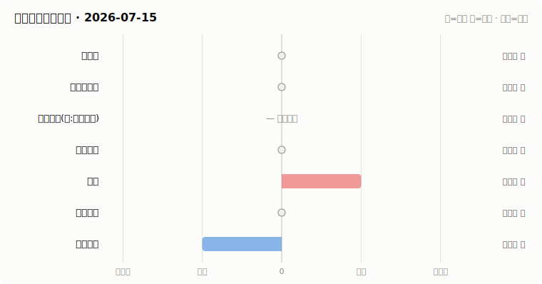

# A股资金动向日报 · 2026-07-15

> 本报告由公开数据自动生成。**方向结论按数据可得性标注置信度**:
> 高=每日硬数据(龙虎榜/公告/两融);中=每日代理指标(行为推断);低=仅低频或间接证据。

## 一、七类资金动向总览

| 参与者 | 动向 | 置信度 | 一句话解读 |
| --- | --- | --- | --- |
| 国家队 | → 中性 | 低 | ETF成交已记录,放量基线累积中(约需一个月),暂不判断方向。 |
| 险资与社保 | → 中性 | 低 | 无涉险资/社保公告;险资无每日数据,默认视为中性。 |
| 公募基金(附:主观私募) | — 数据不足 | 低 | 数据不足。 |
| 量化资金 | → 中性 | 低 | 小微盘成交占比 15.4%,均值基线待历史累积。 |
| 游资 | ↑ 流入 | 高 | 知名游资席位 5 个上榜,合计净买入 +2.7亿。 |
| 产业资本 | → 中性 | 高 | 回购公告 15 家;大宗溢价成交占比 19%。 |
| 普通散户 | ↓ 流出 | 高 | 沪市融资余额环比 -72亿。 |

**历史趋势(随每日运行更新)**

## 二、分项明细

### 2.1 国家队 — → 中性(置信度:低)

- 宽基ETF当日成交已记录;放量倍数需要约一个月历史累积后才能判断,当前为基线建立期。

**汇金系宽基ETF当日成交**

| 代码 | 名称 | 当日成交额 | 相对20日均量 | 涨跌幅 |
| --- | --- | --- | --- | --- |
| 510300 | 华泰柏瑞沪深300ETF | 79.1亿 | 基线累积中 | -1.76% |
| 510050 | 华夏上证50ETF | 37.3亿 | 基线累积中 | -1.96% |
| 510500 | 南方中证500ETF | 46.1亿 | 基线累积中 | -2.39% |
| 159919 | 嘉实沪深300ETF | 11.4亿 | 基线累积中 | -1.82% |
| 588000 | 华夏科创50ETF | 90.3亿 | 基线累积中 | -4.09% |
| 512100 | 南方中证1000ETF | 56.5亿 | 基线累积中 | -2.43% |

### 2.2 险资与社保 — → 中性(置信度:低)

- 当日扫描持股变动公告 32 条,未发现涉险资/社保/举牌关键词。

> ⚠️ 险资/社保没有每日持仓披露:硬数据仅有季报十大流通股东与举牌公告,本节结论置信度恒为低,建议结合季报数据人工复核。

### 2.3 公募基金(附:主观私募) — — 数据不足(置信度:低)

- 全市场ETF总份额 30493亿份(份额环比需要历史数据累积,首日仅记录基数)。
- 近7天新成立权益类基金 0 只,合计募集 0.0亿份(反映公募增量资金入场节奏)。

> ⚠️ 主观私募无每日公开持仓/仓位数据,通常仅有第三方月频仓位调查;本报告不对主观私募单独给出每日方向判断。

### 2.4 量化资金 — → 中性(置信度:低)

- 全市场成交 25733亿,其中中证2000成交 3950亿,小微盘成交占比 15.4%。
- 中证2000当日 -0.80%。小微盘成交占比明显上升通常对应量化(高频/微盘策略)活跃度上升,反之为降杠杆或撤退。

> ⚠️ 20日均值基线累积中(约需一个月历史数据),当前仅记录水平值。
> ⚠️ 量化动向为代理推断:公开数据无法区分具体量化策略,仅反映小微盘交易活跃度整体变化。

### 2.5 游资 — ↑ 流入(置信度:高)

- 拉萨系(散户通道)席位当日买入 5.6亿,净买 -1.7亿(此项同时作为散户情绪参考)。

**当日龙虎榜净买额前8个股**

| 代码 | 名称 | 收盘价 | 涨跌幅 | 龙虎榜净买额 | 上榜原因 |
| --- | --- | --- | --- | --- | --- |
| 002558 | 巨人网络 | 29.56 | +10.01% | 6.9亿 | 日涨幅偏离值达到7%的前5只证券 |
| 002821 | 凯莱英 | 195.75 | +10.00% | 4.1亿 | 日涨幅偏离值达到7%的前5只证券 |
| 001896 | 豫能控股 | 14.95 | +10.01% | 3.6亿 | 日涨幅偏离值达到7%的前5只证券 |
| 688333 | 铂力特 | 116.2 | +16.71% | 3.4亿 | 有价格涨跌幅限制的日收盘价格涨幅达到15%的前五只证券 |
| 600186 | 莲花控股 | 10.25 | +3.02% | 3.2亿 | 有价格涨跌幅限制的日价格振幅达到15%的前五只证券 |
| 002739 | 儒意电影 | 9.38 | +9.96% | 3.1亿 | 日涨幅偏离值达到7%的前5只证券 |
| 002517 | 恺英网络 | 17.18 | +9.99% | 2.8亿 | 日涨幅偏离值达到7%的前5只证券 |
| 300149 | 睿智医药 | 10.39 | +19.98% | 1.3亿 | 日涨幅达到15%的前5只证券 |

**知名游资席位当日动向**

| 营业部名称 | 买入 | 卖出 | 净额 | 买入股票 |
| --- | --- | --- | --- | --- |
| 中信证券股份有限公司上海溧阳路证券营业部 | 2.9亿 | — | 2.9亿 | 铂力特 华曙高科 |
| 东莞证券股份有限公司北京分公司 | 0.5亿 | 0.0亿 | 0.5亿 | 恺英网络 |
| 东吴证券股份有限公司苏州西北街证券营业部 | 0.1亿 | 0.0亿 | 0.1亿 | 生物谷 |
| 华鑫证券有限责任公司上海分公司 | — | 0.0亿 | -0.0亿 | 雪龙集团 |
| 中国银河证券股份有限公司绍兴鲁迅中路证券营业部 | 0.2亿 | 1.0亿 | -0.8亿 | 铖昌科技 |

### 2.6 产业资本 — → 中性(置信度:高)

- 当日更新回购公告 15 家,披露已回购金额合计 1.5亿。
- 大宗交易成交总额 11.3亿,其中溢价成交占比 19.1%(溢价占比高通常代表主动接盘意愿强)。

> ⚠️ 股东增持接口今日不可用。
> ⚠️ 股东减持接口今日不可用。

### 2.7 普通散户 — ↓ 流出(置信度:高)

- 全市场融资余额约 28576亿(沪 14448亿 + 深 14128亿),沪市环比 -72.3亿。
- 最近披露月份(2023-08)新增投资者 99.59 万户,环比 +9.4%(月频指标;该月度口径中登公司已停止披露,仅作历史参考)。

> ⚠️ 个股资金流排行接口今日不可用,小单口径缺失。

## 三、数据说明与局限

- 国家队动向为行为推断(宽基ETF放量+指数走势组合),非官方口径;确认需等季报十大股东。
- 险资/社保、主观私募无每日公开数据,相关结论置信度恒为低。
- 量化动向以小微盘成交占比为代理,只反映整体活跃度,无法区分具体策略。
- 游资识别依赖 config.yaml 中的席位关键词表,存在漏配;拉萨系席位计为散户通道。
- 两融、龙虎榜等数据为 T+1 或盘后披露,个别接口更新时间不一。

**本次运行失败的数据源:**
- stock_ggcg_em: TimeoutError: 
- stock_ggcg_em: TimeoutError: 
- stock_individual_fund_flow_rank: JSONDecodeError: Expecting value: line 1 column 1 (char 0)
