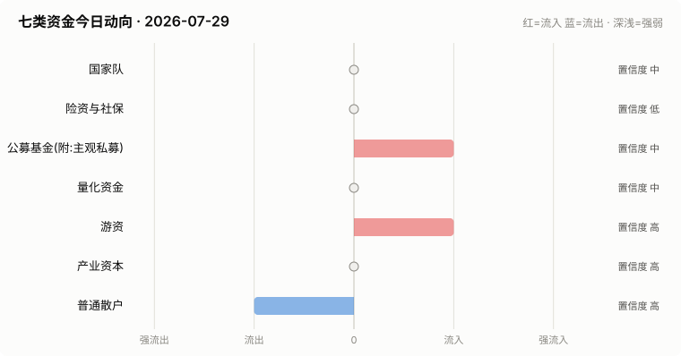

# A股资金动向日报 · 2026-07-29

> 本报告由公开数据自动生成。**方向结论按数据可得性标注置信度**:
> 高=每日硬数据(龙虎榜/公告/两融);中=每日代理指标(行为推断);低=仅低频或间接证据。

## 一、七类资金动向总览

| 参与者 | 动向 | 置信度 | 一句话解读 |
| --- | --- | --- | --- |
| 国家队 | → 中性 | 中 | 宽基ETF成交平稳,未见国家队明显动作。 |
| 险资与社保 | → 中性 | 低 | 无涉险资/社保公告;险资无每日数据,默认视为中性。 |
| 公募基金(附:主观私募) | ↑ 流入 | 中 | 全市场ETF份额环比 +0.63%(申赎代理);近7天新发权益基金 0亿份。 |
| 量化资金 | → 中性 | 中 | 小微盘成交占比较20日均值偏离 -0.4pp,代理量化策略活跃度变化。 |
| 游资 | ↑ 流入 | 高 | 知名游资席位 1 个上榜,合计净买入 +1.4亿。 |
| 产业资本 | → 中性 | 高 | 回购公告 23 家;大宗溢价成交占比 2%。 |
| 普通散户 | ↓ 流出 | 高 | 沪市融资余额环比 -153亿。 |

**历史趋势(随每日运行更新)**

## 二、分项明细

### 2.1 国家队 — → 中性(置信度:中)

- 宽基ETF成交平稳(放量0只),未见明显护盘迹象。

**汇金系宽基ETF当日成交**

| 代码 | 名称 | 当日成交额 | 相对20日均量 | 涨跌幅 |
| --- | --- | --- | --- | --- |
| 510300 | 华泰柏瑞沪深300ETF | 69.9亿 | 0.79x | +0.65% |
| 510050 | 华夏上证50ETF | 30.8亿 | 0.94x | +0.03% |
| 510500 | 南方中证500ETF | 52.4亿 | 0.98x | +1.03% |
| 159919 | 嘉实沪深300ETF | 10.1亿 | 0.68x | +0.56% |
| 588000 | 华夏科创50ETF | 129.6亿 | 1.04x | -0.50% |
| 512100 | 南方中证1000ETF | 80.8亿 | 1.28x | +1.05% |

### 2.2 险资与社保 — → 中性(置信度:低)

- 当日扫描持股变动公告 29 条,未发现涉险资/社保/举牌关键词。

> ⚠️ 险资/社保没有每日持仓披露:硬数据仅有季报十大流通股东与举牌公告,本节结论置信度恒为低,建议结合季报数据人工复核。

### 2.3 公募基金(附:主观私募) — ↑ 流入(置信度:中)

- 全市场ETF总份额较上一交易日变动 +202.8亿份(净申购),以此作为公募被动端申赎代理。
- 近7天新成立权益类基金 3 只,合计募集 0.2亿份(反映公募增量资金入场节奏)。

**近7天新成立权益基金(募集前5)**

| 基金代码 | 基金简称 | 基金类型 | 募集份额 | 成立日期 |
| --- | --- | --- | --- | --- |
| 028370 | 华夏上证综合ETF发起式联接A | 指数型-股票 | 0.12 | 2026-07-24 |
| 028371 | 华夏上证综合ETF发起式联接C | 指数型-股票 | 0.12 | 2026-07-24 |
| 028488 | 中信保诚瑞丰6个月混合D | 混合型-偏债 | — | 2026-07-22 |

> ⚠️ 主观私募无每日公开持仓/仓位数据,通常仅有第三方月频仓位调查;本报告不对主观私募单独给出每日方向判断。

### 2.4 量化资金 — → 中性(置信度:中)

- 全市场成交 22989亿,其中中证2000成交 3425亿,小微盘成交占比 14.9%,较20日均值(15.3%)偏离 -0.4个百分点。
- 中证2000当日 +0.42%。小微盘成交占比明显上升通常对应量化(高频/微盘策略)活跃度上升,反之为降杠杆或撤退。

> ⚠️ 量化动向为代理推断:公开数据无法区分具体量化策略,仅反映小微盘交易活跃度整体变化。

### 2.5 游资 — ↑ 流入(置信度:高)

- 拉萨系(散户通道)席位当日买入 6.8亿,净买 1.8亿(此项同时作为散户情绪参考)。

**当日龙虎榜净买额前8个股**

| 代码 | 名称 | 收盘价 | 涨跌幅 | 龙虎榜净买额 | 上榜原因 |
| --- | --- | --- | --- | --- | --- |
| 002396 | 星网锐捷 | 26.32 | -7.09% | 6.3亿 | 连续三个交易日内，跌幅偏离值累计达到20%的证券 |
| 002558 | 巨人网络 | 26.98 | +9.99% | 3.4亿 | 日涨幅偏离值达到7%的前5只证券 |
| 002517 | 恺英网络 | 16.69 | +10.02% | 1.7亿 | 日涨幅偏离值达到7%的前5只证券 |
| 688260 | 昀冢科技 | 88.51 | +20.00% | 1.7亿 | 有价格涨跌幅限制的日收盘价格涨幅达到15%的前五只证券 |
| 002141 | 贤丰控股 | 6.3 | +9.95% | 1.5亿 | 连续三个交易日内，涨幅偏离值累计达到20%的证券 |
| 603399 | 永杉锂业 | 15.81 | +10.02% | 1.4亿 | 有价格涨跌幅限制的日价格振幅达到15%的前五只证券 |
| 002498 | 汉缆股份 | 7.19 | +9.94% | 1.3亿 | 日涨幅偏离值达到7%的前5只证券 |
| 002212 | 天融信 | 6.6 | +10.00% | 1.3亿 | 连续三个交易日内，涨幅偏离值累计达到20%的证券 |

**知名游资席位当日动向**

| 营业部名称 | 买入 | 卖出 | 净额 | 买入股票 |
| --- | --- | --- | --- | --- |
| 国盛证券股份有限公司宁波桑田路证券营业部 | 1.4亿 | 0.1亿 | 1.4亿 | 风华高科 |

### 2.6 产业资本 — → 中性(置信度:高)

- 当日更新回购公告 23 家,披露已回购金额合计 3.3亿。
- 大宗交易成交总额 12.3亿,其中溢价成交占比 1.8%(溢价占比高通常代表主动接盘意愿强)。

> ⚠️ 股东增持接口今日不可用。
> ⚠️ 股东减持接口今日不可用。

### 2.7 普通散户 — ↓ 流出(置信度:高)

- 全市场融资余额约 26385亿(沪 13490亿 + 深 12895亿),沪市环比 -153.0亿。
- 最近披露月份(2023-08)新增投资者 99.59 万户,环比 +9.4%(月频指标;该月度口径中登公司已停止披露,仅作历史参考)。

> ⚠️ 沪市两融最新数据日期为 2026-07-28,非当日(两融数据 T+1 披露属正常)。
> ⚠️ 深市两融取到的最新日期为 2026-07-28。
> ⚠️ 个股资金流排行接口今日不可用,小单口径缺失。

## 三、个股杠杆监测

- 国家队(汇金系宽基ETF)历来是现金申购,不使用融资杠杆,因此没有可比的每日"国家队杠杆"数字;下面的杠杆水位与排行反映的主要是散户与游资的两融行为。

> ⚠️ 缺失:沪市融资买入额,市场整体杠杆水位无法计算。
> ⚠️ 个股两融明细或实时行情快照接口今日不可用,个股杠杆排行暂缺(不影响市场整体水位);可用本地拉取脚本 scripts/fetch_margin_local.py 补数据。

## 四、数据说明与局限

- 国家队动向为行为推断(宽基ETF放量+指数走势组合),非官方口径;确认需等季报十大股东。
- 险资/社保、主观私募无每日公开数据,相关结论置信度恒为低。
- 量化动向以小微盘成交占比为代理,只反映整体活跃度,无法区分具体策略。
- 游资识别依赖 config.yaml 中的席位关键词表,存在漏配;拉萨系席位计为散户通道。
- 两融、龙虎榜等数据为 T+1 或盘后披露,个别接口更新时间不一。
- 个股杠杆排行剔除了流通市值过小的个股(阈值见 config.yaml),融资余额/买入额与当日行情存在披露时点差异,仅作参考,不构成个股推荐。

**本次运行失败的数据源:**
- stock_ggcg_em: TimeoutError: 
- stock_ggcg_em: TimeoutError: 
- stock_margin_szse: ValueError: Length mismatch: Expected axis has 0 elements, new values have 6 elements
- stock_individual_fund_flow_rank: JSONDecodeError: Expecting value: line 1 column 1 (char 0)
- stock_margin_detail_sse: ValueError: Length mismatch: Expected axis has 0 elements, new values have 13 elements
- stock_zh_a_spot_em: ConnectionError: ('Connection aborted.', RemoteDisconnected('Remote end closed connection without response'))
- stock_zh_a_spot: TimeoutError: 
