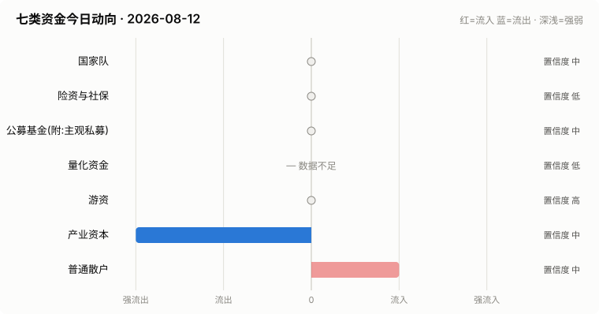

# A股资金动向日报 · 2026-08-12

> 本报告由公开数据自动生成。**方向结论按数据可得性标注置信度**:
> 高=每日硬数据(龙虎榜/公告/两融);中=每日代理指标(行为推断);低=仅低频或间接证据。

> ⚠️ 数据质量提示:本次运行保留了可用字段;缺失字段不补零,备用/历史值不视为当日值。各节中的警告包含具体来源和数据截至日期。

## 一、七类资金动向总览

| 参与者 | 动向 | 置信度 | 一句话解读 |
| --- | --- | --- | --- |
| 国家队 | → 中性 | 中 | 宽基ETF成交平稳,未见国家队明显动作。 |
| 险资与社保 | → 中性 | 低 | 无涉险资/社保公告;险资无每日数据,默认视为中性。 |
| 公募基金(附:主观私募) | → 中性 | 中 | 全市场ETF份额环比 -0.22%(申赎代理);近7天新发权益基金 5亿份。 |
| 量化资金 | — 数据不足 | 低 | 指数数据缺失,无法计算小微盘成交占比。 |
| 游资 | → 中性 | 高 | 知名游资席位 4 个上榜,合计净买入 -0.3亿。 |
| 产业资本 | ↓↓ 大幅流出 | 中 | 净增持家数 -17;回购公告 6 家;大宗溢价成交占比 0%。 |
| 普通散户 | ↑ 流入 | 中 | 沪市融资余额环比 +55亿。 |

**历史趋势(随每日运行更新)**

## 二、分项明细

### 2.1 国家队 — → 中性(置信度:中)

- 宽基ETF成交平稳(放量0只),未见明显护盘迹象。

**汇金系宽基ETF当日成交**

| 代码 | 名称 | 当日成交额 | 相对20日均量 | 涨跌幅 |
| --- | --- | --- | --- | --- |
| 510300 | 华泰柏瑞沪深300ETF | 42.8亿 | 0.61x | +0.42% |
| 510050 | 华夏上证50ETF | 10.6亿 | 0.41x | +0.13% |
| 510500 | 南方中证500ETF | 14.5亿 | 0.30x | +0.80% |
| 159919 | 嘉实沪深300ETF | 6.8亿 | 0.56x | +0.45% |
| 588000 | 华夏科创50ETF | 52.9亿 | 0.46x | +1.50% |
| 512100 | 南方中证1000ETF | 32.3亿 | 0.53x | +1.15% |

### 2.2 险资与社保 — → 中性(置信度:低)

- 当日扫描持股变动公告 26 条,未发现涉险资/社保/举牌关键词。

> ⚠️ 险资/社保没有每日持仓披露:硬数据仅有季报十大流通股东与举牌公告,本节结论置信度恒为低,建议结合季报数据人工复核。

### 2.3 公募基金(附:主观私募) — → 中性(置信度:中)

- 全市场ETF总份额较上一交易日变动 -68.6亿份(净赎回),以此作为公募被动端申赎代理。
- 近7天新成立权益类基金 2 只,合计募集 4.8亿份(反映公募增量资金入场节奏)。

**近7天新成立权益基金(募集前5)**

| 基金代码 | 基金简称 | 基金类型 | 募集份额 | 成立日期 |
| --- | --- | --- | --- | --- |
| 027649 | 国融添瑞债券C | 债券型-混合二级 | 2.4 | 2026-08-05 |
| 027648 | 国融添瑞债券A | 债券型-混合二级 | 2.4 | 2026-08-05 |

> ⚠️ 主观私募无每日公开持仓/仓位数据,通常仅有第三方月频仓位调查;本报告不对主观私募单独给出每日方向判断。

### 2.4 量化资金 — — 数据不足(置信度:低)

> ⚠️ 指数行情缺失:上证综指,量化活跃度无法计算。
> ⚠️ 量化动向为代理推断:公开数据无法区分具体量化策略,仅反映小微盘交易活跃度整体变化。

### 2.5 游资 — → 中性(置信度:高)

- 拉萨系(散户通道)席位当日买入 2.5亿,净买 1.0亿(此项同时作为散户情绪参考)。

**当日龙虎榜净买额前8个股**

| 代码 | 名称 | 收盘价 | 涨跌幅 | 龙虎榜净买额 | 上榜原因 |
| --- | --- | --- | --- | --- | --- |
| 002379 | 宏桥控股 | 21.34 | +10.00% | 4.3亿 | 日涨幅偏离值达到7%的前5只证券 |
| 002031 | 巨轮智能 | 6.42 | +9.93% | 2.6亿 | 连续三个交易日内，涨幅偏离值累计达到20%的证券 |
| 002491 | 通鼎互联 | 18.84 | +9.98% | 1.8亿 | 日涨幅偏离值达到7%的前5只证券 |
| 002229 | 鸿博股份 | 12.91 | +9.97% | 1.7亿 | 连续三个交易日内，涨幅偏离值累计达到20%的证券 |
| 600721 | 百花医药 | 14.03 | +10.04% | 1.5亿 | 有价格涨跌幅限制的日收盘价格涨幅偏离值达到7%的前五只证券 |
| 002173 | 创新医疗 | 22.42 | +5.56% | 1.4亿 | 日换手率达到20%的前5只证券 |
| 603399 | 永杉锂业 | 16.81 | +6.93% | 1.1亿 | 有价格涨跌幅限制的日换手率达到20%的前五只证券 |
| 688635 | 长进光子 | 300.02 | +20.00% | 1.0亿 | 有价格涨跌幅限制的日收盘价格涨幅达到15%的前五只证券 |

**知名游资席位当日动向**

| 营业部名称 | 买入 | 卖出 | 净额 | 买入股票 |
| --- | --- | --- | --- | --- |
| 华鑫证券有限责任公司上海分公司 | 0.4亿 | 0.1亿 | 0.3亿 | 巨轮智能 |
| 中国银河证券股份有限公司绍兴鲁迅中路证券营业部 | 0.2亿 | — | 0.2亿 | 亚泰集团 |
| 华泰证券股份有限公司深圳益田路荣超商务中心证券营业部 | 0.0亿 | 0.1亿 | -0.1亿 | 威士顿 |
| 国盛证券股份有限公司宁波桑田路证券营业部 | 0.5亿 | 1.3亿 | -0.7亿 | 百花医药 联瑞新材 |

### 2.6 产业资本 — ↓↓ 大幅流出(置信度:中)

- 当日增持公告 4 家,减持公告 21 家,净增持家数 -17。
- 当日更新回购公告 6 家,披露已回购金额合计 0.6亿。
- 大宗交易成交总额 12.2亿,其中溢价成交占比 0.2%(溢价占比高通常代表主动接盘意愿强)。

> ⚠️ 股东增减持计数采用stock_notice_report 持股变动公告代理(非精确股东变动明细),数据截至 2026-08-12(报告日期 2026-08-12)。

### 2.7 普通散户 — ↑ 流入(置信度:中)

- 全市场融资余额约 26293亿(沪 13501亿 + 深 12792亿),沪市环比 54.7亿。
- 最近披露月份(2023-08)新增投资者 99.59 万户,环比 +9.4%(月频指标;该月度口径中登公司已停止披露,仅作历史参考)。

> ⚠️ 沪市融资余额采用历史两融快照,数据截至 2026-08-11(报告日期 2026-08-12,滞后 1 个日历日)。
> ⚠️ 沪市融资买入额采用历史两融快照,数据截至 2026-08-11(报告日期 2026-08-12,滞后 1 个日历日)。
> ⚠️ 深市融资余额采用stock_margin_szse,数据截至 2026-08-11(报告日期 2026-08-12,滞后 1 个日历日)。
> ⚠️ 深市融资买入额采用stock_margin_szse,数据截至 2026-08-11(报告日期 2026-08-12,滞后 1 个日历日)。
> ⚠️ 个股资金流排行、大盘资金流代理及短期历史快照均不可用,小单口径缺失。

## 三、个股杠杆监测

- 国家队(汇金系宽基ETF)历来是现金申购,不使用融资杠杆,因此没有可比的每日"国家队杠杆"数字;下面的杠杆水位与排行反映的主要是散户与游资的两融行为。
- 当日纳入统计的1661只个股中,156只融资余额占流通市值超过8%(阈值见 config.yaml);建议持有这类个股时使用更紧的止损比例(参考仓位/止损计算器,该工具支持按代码查询个股杠杆水位)。

**个股杠杆最集中(前15只,2026-08-11两融数据)**

| 代码 | 名称 | 融资买入占成交额% | 融资余额占流通市值% | 当日涨跌幅% | 当日振幅% |
| --- | --- | --- | --- | --- | --- |
| 301626 | 苏州天脉 | 50.03 | 14.43 | -1.17 | 5.36 |
| 301332 | 德尔玛 | 43.88 | 6.04 | 0.5 | 1.63 |
| 002539 | 云图控股 | 41.52 | 4.63 | 0.79 | 3.0 |
| 300835 | 龙磁科技 | 33.24 | 3.12 | 0.57 | 2.96 |
| 301258 | 富士莱 | 31.04 | 2.79 | 0.54 | 2.18 |
| 000029 | 深深房Ａ | 29.73 | 2.79 | 0.91 | 3.18 |
| 002595 | 豪迈科技 | 27.64 | 1.09 | -0.06 | 1.78 |
| 301058 | 中粮科工 | 27.58 | 4.59 | 0.48 | 1.07 |
| 301367 | 瑞迈特 | 26.77 | 3.63 | 0.36 | 1.74 |
| 002189 | 中光学 | 26.68 | 8.31 | 0.05 | 1.72 |
| 001390 | 古麒绒材 | 26.59 | 3.17 | 0.06 | 2.17 |
| 002783 | 凯龙股份 | 25.74 | 10.63 | -0.38 | 2.53 |
| 300909 | 汇创达 | 25.6 | 7.25 | 0.27 | 2.37 |
| 000983 | 山西焦煤 | 25.5 | 1.71 | -1.6 | 3.06 |
| 000922 | 佳电股份 | 25.42 | 5.61 | 0.75 | 2.92 |

> ⚠️ 缺失:沪市成交额,市场整体杠杆水位无法计算。
> ⚠️ 实时行情快照主源不可用,本次排行采用腾讯备用源(数据截至 2026-08-12)。
> ⚠️ 个股两融明细缺失沪市,排行仅使用可用市场明细(数据截至 2026-08-11)。

## 四、数据说明与局限

- 国家队动向为行为推断(宽基ETF放量+指数走势组合),非官方口径;确认需等季报十大股东。
- 险资/社保、主观私募无每日公开数据,相关结论置信度恒为低。
- 量化动向以小微盘成交占比为代理,只反映整体活跃度,无法区分具体策略。
- 游资识别依赖 config.yaml 中的席位关键词表,存在漏配;拉萨系席位计为散户通道。
- 两融、龙虎榜等数据为 T+1 或盘后披露,个别接口更新时间不一。
- 个股杠杆排行剔除了流通市值过小的个股(阈值见 config.yaml),融资余额/买入额与当日行情存在披露时点差异,仅作参考,不构成个股推荐。
> ⚠️ 本报告含缺失、备用或历史快照数据;每条降级数字均按“数据截至 YYYY-MM-DD”标注真实新鲜度。

**本次运行的数据质量明细:**
- 量化资金: 指数行情缺失:上证综指,量化活跃度无法计算。
- 产业资本: 股东增减持计数采用stock_notice_report 持股变动公告代理(非精确股东变动明细),数据截至 2026-08-12(报告日期 2026-08-12)。
- 普通散户: 沪市融资余额采用历史两融快照,数据截至 2026-08-11(报告日期 2026-08-12,滞后 1 个日历日)。
- 普通散户: 沪市融资买入额采用历史两融快照,数据截至 2026-08-11(报告日期 2026-08-12,滞后 1 个日历日)。
- 普通散户: 深市融资余额采用stock_margin_szse,数据截至 2026-08-11(报告日期 2026-08-12,滞后 1 个日历日)。
- 普通散户: 深市融资买入额采用stock_margin_szse,数据截至 2026-08-11(报告日期 2026-08-12,滞后 1 个日历日)。
- 普通散户: 个股资金流排行、大盘资金流代理及短期历史快照均不可用,小单口径缺失。
- 个股杠杆监测: 缺失:沪市成交额,市场整体杠杆水位无法计算。
- 个股杠杆监测: 实时行情快照主源不可用,本次排行采用腾讯备用源(数据截至 2026-08-12)。
- 个股杠杆监测: 个股两融明细缺失沪市,排行仅使用可用市场明细(数据截至 2026-08-11)。

**本次运行失败的数据源:**
- stock_sse_deal_daily: JSONDecodeError: Expecting value: line 1 column 1 (char 0)
- stock_ggcg_em: TimeoutError: 
- stock_ggcg_em: TimeoutError: 
- stock_margin_sse: JSONDecodeError: Expecting value: line 1 column 1 (char 0)
- stock_margin_szse: ValueError: Length mismatch: Expected axis has 0 elements, new values have 6 elements
- stock_individual_fund_flow_rank: JSONDecodeError: Expecting value: line 1 column 1 (char 0)
- stock_market_fund_flow: ConnectionError: ('Connection aborted.', RemoteDisconnected('Remote end closed connection without response'))
- stock_margin_detail_sse: JSONDecodeError: Expecting value: line 1 column 1 (char 0)
- stock_margin_detail_sse: JSONDecodeError: Expecting value: line 1 column 1 (char 0)
- stock_zh_a_spot_em: ConnectionError: ('Connection aborted.', RemoteDisconnected('Remote end closed connection without response'))
