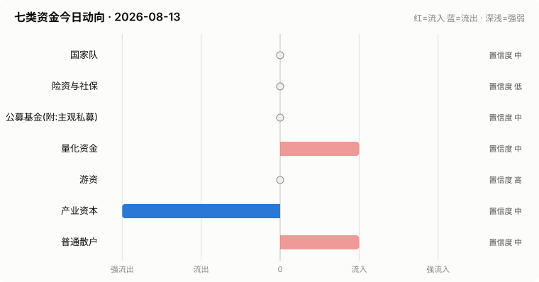

# A股资金动向日报 · 2026-08-13

> 本报告由公开数据自动生成。**方向结论按数据可得性标注置信度**:
> 高=每日硬数据(龙虎榜/公告/两融);中=每日代理指标(行为推断);低=仅低频或间接证据。

> ⚠️ 数据质量提示:本次运行保留了可用字段;缺失字段不补零,备用/历史值不视为当日值。各节中的警告包含具体来源和数据截至日期。

## 一、七类资金动向总览

| 参与者 | 动向 | 置信度 | 一句话解读 |
| --- | --- | --- | --- |
| 国家队 | → 中性 | 中 | 宽基ETF成交平稳,未见国家队明显动作。 |
| 险资与社保 | → 中性 | 低 | 无涉险资/社保公告;险资无每日数据,默认视为中性。 |
| 公募基金(附:主观私募) | → 中性 | 中 | 全市场ETF份额环比 -0.06%(申赎代理);近7天新发权益基金 1亿份。 |
| 量化资金 | ↑ 流入 | 中 | 小微盘成交占比较20日均值偏离 +2.6pp,代理量化策略活跃度变化。 |
| 游资 | → 中性 | 高 | 知名游资席位 1 个上榜,合计净买入 +0.2亿。 |
| 产业资本 | ↓↓ 大幅流出 | 中 | 净增持家数 -11;回购公告 10 家;大宗溢价成交占比 0%。 |
| 普通散户 | ↑ 流入 | 中 | 沪市融资余额环比 +48亿。 |

**历史趋势(随每日运行更新)**

## 二、分项明细

### 2.1 国家队 — → 中性(置信度:中)

- 宽基ETF成交平稳(放量0只),未见明显护盘迹象。

**汇金系宽基ETF当日成交**

| 代码 | 名称 | 当日成交额 | 相对20日均量 | 涨跌幅 |
| --- | --- | --- | --- | --- |
| 510300 | 华泰柏瑞沪深300ETF | 43.6亿 | 0.64x | -0.40% |
| 510050 | 华夏上证50ETF | 12.7亿 | 0.51x | -0.20% |
| 510500 | 南方中证500ETF | 28.4亿 | 0.61x | -0.91% |
| 159919 | 嘉实沪深300ETF | 7.4亿 | 0.63x | -0.42% |
| 588000 | 华夏科创50ETF | 74.8亿 | 0.67x | -1.15% |
| 512100 | 南方中证1000ETF | 29.4亿 | 0.49x | -0.89% |

### 2.2 险资与社保 — → 中性(置信度:低)

- 当日扫描持股变动公告 18 条,未发现涉险资/社保/举牌关键词。

> ⚠️ 险资/社保没有每日持仓披露:硬数据仅有季报十大流通股东与举牌公告,本节结论置信度恒为低,建议结合季报数据人工复核。

### 2.3 公募基金(附:主观私募) — → 中性(置信度:中)

- 全市场ETF总份额较上一交易日变动 -18.2亿份(净赎回),以此作为公募被动端申赎代理。
- 近7天新成立权益类基金 2 只,合计募集 0.6亿份(反映公募增量资金入场节奏)。

**近7天新成立权益基金(募集前5)**

| 基金代码 | 基金简称 | 基金类型 | 募集份额 | 成立日期 |
| --- | --- | --- | --- | --- |
| 028405 | 富国中证金融科技主题ETF发起式联接C | 指数型-股票 | 0.28 | 2026-08-06 |
| 028404 | 富国中证金融科技主题ETF发起式联接A | 指数型-股票 | 0.28 | 2026-08-06 |

> ⚠️ 主观私募无每日公开持仓/仓位数据,通常仅有第三方月频仓位调查;本报告不对主观私募单独给出每日方向判断。

### 2.4 量化资金 — ↑ 流入(置信度:中)

- 全市场成交 25540亿,其中中证2000成交 4686亿,小微盘成交占比 18.3%,较20日均值(15.8%)偏离 +2.6个百分点。
- 中证2000当日 -1.11%。小微盘成交占比明显上升通常对应量化(高频/微盘策略)活跃度上升,反之为降杠杆或撤退。

> ⚠️ 量化动向为代理推断:公开数据无法区分具体量化策略,仅反映小微盘交易活跃度整体变化。

### 2.5 游资 — → 中性(置信度:高)

- 拉萨系(散户通道)席位当日买入 3.7亿,净买 1.4亿(此项同时作为散户情绪参考)。

**当日龙虎榜净买额前8个股**

| 代码 | 名称 | 收盘价 | 涨跌幅 | 龙虎榜净买额 | 上榜原因 |
| --- | --- | --- | --- | --- | --- |
| 000887 | 中鼎股份 | 23.69 | +9.98% | 3.5亿 | 日涨幅偏离值达到7%的前5只证券 |
| 603236 | 移远通信 | 59.43 | +9.99% | 3.5亿 | 单只标的证券的当日融资买入数量达到当日该证券总交易量的50％以上 |
| 300534 | 陇神戎发 | 18.92 | +19.97% | 2.7亿 | 日换手率达到30%的前5只证券 |
| 002354 | 天娱数科 | 8.35 | -2.11% | 2.4亿 | 日换手率达到20%的前5只证券 |
| 603990 | 麦迪科技 | 22.26 | -9.99% | 1.5亿 | 有价格涨跌幅限制的日收盘价格跌幅偏离值达到7%的前五只证券 |
| 110103 | N申能转 | 157.3 | +57.30% | 1.5亿 | 向不特定对象发行的可转债上市首日交易公开信息 |
| 603466 | 风语筑 | 13.72 | +10.02% | 1.5亿 | 非S证券连续三个交易日内收盘价格涨幅偏离值累计达到20%的证券 |
| 002792 | 通宇通讯 | 38.63 | +4.10% | 1.3亿 | 日换手率达到20%的前5只证券 |

**知名游资席位当日动向**

| 营业部名称 | 买入 | 卖出 | 净额 | 买入股票 |
| --- | --- | --- | --- | --- |
| 中国银河证券股份有限公司绍兴鲁迅中路证券营业部 | 0.5亿 | 0.3亿 | 0.2亿 | 鸿博股份 亚泰集团 |

### 2.6 产业资本 — ↓↓ 大幅流出(置信度:中)

- 当日增持公告 2 家,减持公告 13 家,净增持家数 -11。
- 当日更新回购公告 10 家,披露已回购金额合计 3.1亿。
- 大宗交易成交总额 15.0亿,其中溢价成交占比 0.4%(溢价占比高通常代表主动接盘意愿强)。

> ⚠️ 股东增减持计数采用stock_notice_report 持股变动公告代理(非精确股东变动明细),数据截至 2026-08-13(报告日期 2026-08-13)。

### 2.7 普通散户 — ↑ 流入(置信度:中)

- 全市场融资余额约 26390亿(沪 13552亿 + 深 12837亿),沪市环比 48.1亿。
- 最近披露月份(2023-08)新增投资者 99.59 万户,环比 +9.4%(月频指标;该月度口径中登公司已停止披露,仅作历史参考)。

> ⚠️ 沪市融资余额采用stock_margin_sse,数据截至 2026-08-12(报告日期 2026-08-13,滞后 1 个日历日)。
> ⚠️ 沪市融资买入额采用stock_margin_sse,数据截至 2026-08-12(报告日期 2026-08-13,滞后 1 个日历日)。
> ⚠️ 深市融资余额采用stock_margin_szse,数据截至 2026-08-12(报告日期 2026-08-13,滞后 1 个日历日)。
> ⚠️ 深市融资买入额采用stock_margin_szse,数据截至 2026-08-12(报告日期 2026-08-13,滞后 1 个日历日)。
> ⚠️ 个股资金流排行、大盘资金流代理及短期历史快照均不可用,小单口径缺失。

## 三、个股杠杆监测

- 当日两融资金参与度(融资买入额/两市成交额)约 7.90%(比例越高说明当日交易中加杠杆买入的比重越大,市场波动风险通常也更高)。
- 国家队(汇金系宽基ETF)历来是现金申购,不使用融资杠杆,因此没有可比的每日"国家队杠杆"数字;下面的杠杆水位与排行反映的主要是散户与游资的两融行为。
- 当日纳入统计的3249只个股中,259只融资余额占流通市值超过8%(阈值见 config.yaml);建议持有这类个股时使用更紧的止损比例(参考仓位/止损计算器,该工具支持按代码查询个股杠杆水位)。

**个股杠杆最集中(前15只,2026-08-12两融数据)**

| 代码 | 名称 | 融资买入占成交额% | 融资余额占流通市值% | 当日涨跌幅% | 当日振幅% |
| --- | --- | --- | --- | --- | --- |
| 600278 | 东方创业 | 44.62 | 3.53 | -1.58 | 2.37 |
| 688162 | 巨一科技 | 42.94 | 2.15 | -1.49 | 4.09 |
| 688013 | 天臣医疗 | 39.45 | 4.71 | 0.0 | 4.06 |
| 688015 | 交控科技 | 34.01 | 3.66 | -1.31 | 2.5 |
| 600477 | 杭萧钢构 | 30.63 | 3.67 | -2.38 | 2.78 |
| 301296 | 新巨丰 | 30.36 | 3.46 | -1.24 | 1.56 |
| 688685 | 迈信林 | 29.61 | 6.89 | -3.64 | 6.6 |
| 600251 | 冠农股份 | 29.11 | 5.65 | -1.72 | 2.73 |
| 603301 | 振德医疗 | 26.97 | 6.42 | 0.21 | 4.43 |
| 688218 | 江苏北人 | 26.7 | 9.52 | -3.51 | 4.28 |
| 301088 | 戎美股份 | 25.92 | 1.81 | 0.63 | 2.13 |
| 002299 | 圣农发展 | 25.91 | 1.64 | -1.1 | 2.02 |
| 301168 | 通灵股份 | 25.84 | 8.89 | -2.94 | 4.29 |
| 600071 | 凤凰光学 | 25.49 | 4.33 | -2.54 | 3.9 |
| 000831 | 中国稀土 | 25.4 | 5.87 | -2.07 | 2.46 |

> ⚠️ 沪市融资买入额采用stock_margin_sse,数据截至 2026-08-12(报告日期 2026-08-13,滞后 1 个日历日)。
> ⚠️ 深市融资买入额采用stock_margin_szse,数据截至 2026-08-12(报告日期 2026-08-13,滞后 1 个日历日)。
> ⚠️ 实时行情快照主源不可用,本次排行采用腾讯备用源(数据截至 2026-08-13)。

## 四、数据说明与局限

- 国家队动向为行为推断(宽基ETF放量+指数走势组合),非官方口径;确认需等季报十大股东。
- 险资/社保、主观私募无每日公开数据,相关结论置信度恒为低。
- 量化动向以小微盘成交占比为代理,只反映整体活跃度,无法区分具体策略。
- 游资识别依赖 config.yaml 中的席位关键词表,存在漏配;拉萨系席位计为散户通道。
- 两融、龙虎榜等数据为 T+1 或盘后披露,个别接口更新时间不一。
- 个股杠杆排行剔除了流通市值过小的个股(阈值见 config.yaml),融资余额/买入额与当日行情存在披露时点差异,仅作参考,不构成个股推荐。
> ⚠️ 本报告含缺失、备用或历史快照数据;每条降级数字均按“数据截至 YYYY-MM-DD”标注真实新鲜度。

**本次运行的数据质量明细:**
- 产业资本: 股东增减持计数采用stock_notice_report 持股变动公告代理(非精确股东变动明细),数据截至 2026-08-13(报告日期 2026-08-13)。
- 普通散户: 沪市融资余额采用stock_margin_sse,数据截至 2026-08-12(报告日期 2026-08-13,滞后 1 个日历日)。
- 普通散户: 沪市融资买入额采用stock_margin_sse,数据截至 2026-08-12(报告日期 2026-08-13,滞后 1 个日历日)。
- 普通散户: 深市融资余额采用stock_margin_szse,数据截至 2026-08-12(报告日期 2026-08-13,滞后 1 个日历日)。
- 普通散户: 深市融资买入额采用stock_margin_szse,数据截至 2026-08-12(报告日期 2026-08-13,滞后 1 个日历日)。
- 普通散户: 个股资金流排行、大盘资金流代理及短期历史快照均不可用,小单口径缺失。
- 个股杠杆监测: 沪市融资买入额采用stock_margin_sse,数据截至 2026-08-12(报告日期 2026-08-13,滞后 1 个日历日)。
- 个股杠杆监测: 深市融资买入额采用stock_margin_szse,数据截至 2026-08-12(报告日期 2026-08-13,滞后 1 个日历日)。
- 个股杠杆监测: 实时行情快照主源不可用,本次排行采用腾讯备用源(数据截至 2026-08-13)。

**本次运行失败的数据源:**
- stock_ggcg_em: ChunkedEncodingError: Response ended prematurely
- stock_ggcg_em: TimeoutError: 
- stock_margin_szse: ValueError: Length mismatch: Expected axis has 0 elements, new values have 6 elements
- stock_individual_fund_flow_rank: JSONDecodeError: Expecting value: line 1 column 1 (char 0)
- stock_market_fund_flow: ConnectionError: ('Connection aborted.', RemoteDisconnected('Remote end closed connection without response'))
- stock_margin_detail_sse: ValueError: Length mismatch: Expected axis has 0 elements, new values have 13 elements
- stock_zh_a_spot_em: ConnectionError: ('Connection aborted.', RemoteDisconnected('Remote end closed connection without response'))
