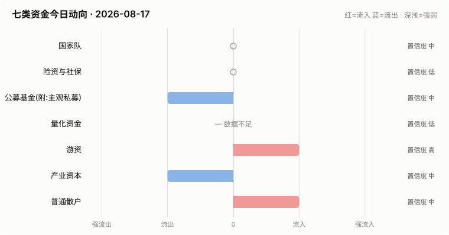

# A股资金动向日报 · 2026-08-17

> 本报告由公开数据自动生成。**方向结论按数据可得性标注置信度**:
> 高=每日硬数据(龙虎榜/公告/两融);中=每日代理指标(行为推断);低=仅低频或间接证据。

> ⚠️ 数据质量提示:本次运行保留了可用字段;缺失字段不补零,备用/历史值不视为当日值。各节中的警告包含具体来源和数据截至日期。

## 一、七类资金动向总览

| 参与者 | 动向 | 置信度 | 一句话解读 |
| --- | --- | --- | --- |
| 国家队 | → 中性 | 中 | 宽基ETF成交平稳,未见国家队明显动作。 |
| 险资与社保 | → 中性 | 低 | 无涉险资/社保公告;险资无每日数据,默认视为中性。 |
| 公募基金(附:主观私募) | ↓ 流出 | 中 | 全市场ETF份额环比 -0.53%(申赎代理);近7天新发权益基金 0亿份。 |
| 量化资金 | — 数据不足 | 低 | 指数数据缺失,无法计算小微盘成交占比。 |
| 游资 | ↑ 流入 | 高 | 知名游资席位 3 个上榜,合计净买入 +2.4亿。 |
| 产业资本 | ↓ 流出 | 中 | 净增持家数 +0;回购公告 4 家;大宗溢价成交占比 0%。 |
| 普通散户 | ↑ 流入 | 中 | 沪市融资余额环比 +51亿。 |

**历史趋势(随每日运行更新)**

## 二、分项明细

### 2.1 国家队 — → 中性(置信度:中)

- 宽基ETF成交平稳(放量0只),未见明显护盘迹象。

**汇金系宽基ETF当日成交**

| 代码 | 名称 | 当日成交额 | 相对20日均量 | 涨跌幅 |
| --- | --- | --- | --- | --- |
| 510300 | 华泰柏瑞沪深300ETF | 39.9亿 | 0.60x | +1.59% |
| 510050 | 华夏上证50ETF | 13.1亿 | 0.55x | +1.03% |
| 510500 | 南方中证500ETF | 22.7亿 | 0.49x | +2.49% |
| 159919 | 嘉实沪深300ETF | 7.7亿 | 0.67x | +1.60% |
| 588000 | 华夏科创50ETF | 78.5亿 | 0.71x | +4.08% |
| 512100 | 南方中证1000ETF | 28.0亿 | 0.48x | +2.54% |

### 2.2 险资与社保 — → 中性(置信度:低)

- 当日扫描持股变动公告 4 条,未发现涉险资/社保/举牌关键词。

> ⚠️ 险资/社保没有每日持仓披露:硬数据仅有季报十大流通股东与举牌公告,本节结论置信度恒为低,建议结合季报数据人工复核。

### 2.3 公募基金(附:主观私募) — ↓ 流出(置信度:中)

- 全市场ETF总份额较上一交易日变动 -166.6亿份(净赎回),以此作为公募被动端申赎代理。
- 近7天新成立权益类基金 0 只,合计募集 0.0亿份(反映公募增量资金入场节奏)。

> ⚠️ 主观私募无每日公开持仓/仓位数据,通常仅有第三方月频仓位调查;本报告不对主观私募单独给出每日方向判断。

### 2.4 量化资金 — — 数据不足(置信度:低)

> ⚠️ 指数行情缺失:上证综指,量化活跃度无法计算。
> ⚠️ 量化动向为代理推断:公开数据无法区分具体量化策略,仅反映小微盘交易活跃度整体变化。

### 2.5 游资 — ↑ 流入(置信度:高)

- 拉萨系(散户通道)席位当日买入 4.4亿,净买 1.3亿(此项同时作为散户情绪参考)。

**当日龙虎榜净买额前8个股**

| 代码 | 名称 | 收盘价 | 涨跌幅 | 龙虎榜净买额 | 上榜原因 |
| --- | --- | --- | --- | --- | --- |
| 002156 | 通富微电 | 69.26 | +10.01% | 10.2亿 | 日涨幅偏离值达到7%的前5只证券 |
| 300862 | 蓝盾光电 | 54.77 | +15.82% | 3.9亿 | 连续三个交易日内，涨幅偏离值累计达到30%的证券 |
| 002436 | 兴森科技 | 38.3 | +9.99% | 3.4亿 | 日涨幅偏离值达到7%的前5只证券 |
| 301282 | 金禄电子 | 35.17 | +19.99% | 2.1亿 | 日涨幅达到15%的前5只证券 |
| 301127 | 武汉天源 | 18.14 | +19.97% | 1.9亿 | 日涨幅达到15%的前5只证券 |
| 300570 | 太辰光 | 193.8 | +20.00% | 1.8亿 | 日涨幅达到15%的前5只证券 |
| 300189 | 神农种业 | 5.19 | +11.13% | 1.2亿 | 日换手率达到30%的前5只证券 |
| 301626 | 苏州天脉 | 307.08 | +20.00% | 1.2亿 | 日涨幅达到15%的前5只证券 |

**知名游资席位当日动向**

| 营业部名称 | 买入 | 卖出 | 净额 | 买入股票 |
| --- | --- | --- | --- | --- |
| 国盛证券股份有限公司宁波桑田路证券营业部 | 2.1亿 | — | 2.1亿 | 莲花控股 |
| 东吴证券股份有限公司苏州西北街证券营业部 | 0.3亿 | 0.0亿 | 0.3亿 | 金螳螂 |
| 华鑫证券有限责任公司上海分公司 | — | 0.0亿 | -0.0亿 | 天源转债 正裕工业 |

### 2.6 产业资本 — ↓ 流出(置信度:中)

- 当日增持公告 1 家,减持公告 1 家,净增持家数 +0。
- 当日更新回购公告 4 家,披露已回购金额合计 0.4亿。
- 大宗交易成交总额 15.3亿,其中溢价成交占比 0.3%(溢价占比高通常代表主动接盘意愿强)。

> ⚠️ 股东增减持计数采用stock_notice_report 持股变动公告代理(非精确股东变动明细),数据截至 2026-08-17(报告日期 2026-08-17)。

### 2.7 普通散户 — ↑ 流入(置信度:中)

- 全市场融资余额约 26398亿(沪 13552亿 + 深 12845亿),沪市环比 51.5亿。
- 最近披露月份(2023-08)新增投资者 99.59 万户,环比 +9.4%(月频指标;该月度口径中登公司已停止披露,仅作历史参考)。

> ⚠️ 沪市融资余额采用历史两融快照,数据截至 2026-08-13(报告日期 2026-08-17,滞后 4 个日历日)。
> ⚠️ 沪市融资买入额采用历史两融快照,数据截至 2026-08-13(报告日期 2026-08-17,滞后 4 个日历日)。
> ⚠️ 深市融资余额采用stock_margin_szse,数据截至 2026-08-14(报告日期 2026-08-17,滞后 3 个日历日)。
> ⚠️ 深市融资买入额采用stock_margin_szse,数据截至 2026-08-14(报告日期 2026-08-17,滞后 3 个日历日)。
> ⚠️ 个股资金流排行、大盘资金流代理及短期历史快照均不可用,小单口径缺失。

## 三、个股杠杆监测

- 国家队(汇金系宽基ETF)历来是现金申购,不使用融资杠杆,因此没有可比的每日"国家队杠杆"数字;下面的杠杆水位与排行反映的主要是散户与游资的两融行为。
- 当日纳入统计的1667只个股中,147只融资余额占流通市值超过8%(阈值见 config.yaml);建议持有这类个股时使用更紧的止损比例(参考仓位/止损计算器,该工具支持按代码查询个股杠杆水位)。

**个股杠杆最集中(前15只,2026-08-14两融数据)**

| 代码 | 名称 | 融资买入占成交额% | 融资余额占流通市值% | 当日涨跌幅% | 当日振幅% |
| --- | --- | --- | --- | --- | --- |
| 002876 | 三利谱 | 54.73 | 8.11 | 2.86 | 4.92 |
| 000932 | 华菱钢铁 | 30.08 | 4.02 | 0.0 | 1.39 |
| 300862 | 蓝盾光电 | 29.43 | 8.16 | 15.82 | 15.61 |
| 002238 | 天威视讯 | 27.46 | 1.52 | 0.0 | 1.96 |
| 000166 | 申万宏源 | 27.37 | 3.32 | 0.44 | 1.1 |
| 301160 | 翔楼新材 | 26.88 | 9.36 | 2.39 | 4.53 |
| 002095 | 生 意 宝 | 26.66 | 5.28 | 0.07 | 2.03 |
| 000728 | 国元证券 | 26.23 | 6.59 | 0.42 | 0.7 |
| 000927 | 中国铁物 | 26.08 | 2.26 | 1.25 | 2.5 |
| 301088 | 戎美股份 | 25.87 | 1.96 | -0.93 | 2.94 |
| 000006 | 深振业Ａ | 25.85 | 7.32 | -2.53 | 4.12 |
| 300909 | 汇创达 | 24.35 | 7.72 | 0.31 | 4.2 |
| 002807 | 江阴银行 | 23.66 | 3.66 | 0.0 | 1.03 |
| 000623 | 吉林敖东 | 23.38 | 6.56 | 1.06 | 2.11 |
| 000887 | 中鼎股份 | 23.32 | 5.76 | -3.99 | 6.69 |

> ⚠️ 缺失:沪市成交额,市场整体杠杆水位无法计算。
> ⚠️ 实时行情快照主源不可用,本次排行采用腾讯备用源(数据截至 2026-08-17)。
> ⚠️ 个股两融明细缺失沪市,排行仅使用可用市场明细(数据截至 2026-08-14)。

## 四、数据说明与局限

- 国家队动向为行为推断(宽基ETF放量+指数走势组合),非官方口径;确认需等季报十大股东。
- 险资/社保、主观私募无每日公开数据,相关结论置信度恒为低。
- 量化动向以小微盘成交占比为代理,只反映整体活跃度,无法区分具体策略。
- 游资识别依赖 config.yaml 中的席位关键词表,存在漏配;拉萨系席位计为散户通道。
- 两融、龙虎榜等数据为 T+1 或盘后披露,个别接口更新时间不一。
- 个股杠杆排行剔除了流通市值过小的个股(阈值见 config.yaml),融资余额/买入额与当日行情存在披露时点差异,仅作参考,不构成个股推荐。
> ⚠️ 本报告含缺失、备用或历史快照数据;每条降级数字均按“数据截至 YYYY-MM-DD”标注真实新鲜度。

**本次运行的数据质量明细:**
- 量化资金: 指数行情缺失:上证综指,量化活跃度无法计算。
- 产业资本: 股东增减持计数采用stock_notice_report 持股变动公告代理(非精确股东变动明细),数据截至 2026-08-17(报告日期 2026-08-17)。
- 普通散户: 沪市融资余额采用历史两融快照,数据截至 2026-08-13(报告日期 2026-08-17,滞后 4 个日历日)。
- 普通散户: 沪市融资买入额采用历史两融快照,数据截至 2026-08-13(报告日期 2026-08-17,滞后 4 个日历日)。
- 普通散户: 深市融资余额采用stock_margin_szse,数据截至 2026-08-14(报告日期 2026-08-17,滞后 3 个日历日)。
- 普通散户: 深市融资买入额采用stock_margin_szse,数据截至 2026-08-14(报告日期 2026-08-17,滞后 3 个日历日)。
- 普通散户: 个股资金流排行、大盘资金流代理及短期历史快照均不可用,小单口径缺失。
- 个股杠杆监测: 缺失:沪市成交额,市场整体杠杆水位无法计算。
- 个股杠杆监测: 实时行情快照主源不可用,本次排行采用腾讯备用源(数据截至 2026-08-17)。
- 个股杠杆监测: 个股两融明细缺失沪市,排行仅使用可用市场明细(数据截至 2026-08-14)。

**本次运行失败的数据源:**
- stock_sse_deal_daily: JSONDecodeError: Expecting value: line 1 column 1 (char 0)
- stock_ggcg_em: TimeoutError: 
- stock_ggcg_em: TimeoutError: 
- stock_margin_sse: JSONDecodeError: Expecting value: line 1 column 1 (char 0)
- stock_margin_szse: ValueError: Length mismatch: Expected axis has 0 elements, new values have 6 elements
- stock_margin_szse: ValueError: Length mismatch: Expected axis has 0 elements, new values have 6 elements
- stock_margin_szse: ValueError: Length mismatch: Expected axis has 0 elements, new values have 6 elements
- stock_individual_fund_flow_rank: JSONDecodeError: Expecting value: line 1 column 1 (char 0)
- stock_market_fund_flow: ConnectionError: ('Connection aborted.', RemoteDisconnected('Remote end closed connection without response'))
- stock_margin_detail_sse: JSONDecodeError: Expecting value: line 1 column 1 (char 0)
- stock_margin_detail_sse: JSONDecodeError: Expecting value: line 1 column 1 (char 0)
- stock_margin_detail_sse: JSONDecodeError: Expecting value: line 1 column 1 (char 0)
- stock_margin_detail_sse: JSONDecodeError: Expecting value: line 1 column 1 (char 0)
- stock_zh_a_spot_em: ConnectionError: ('Connection aborted.', RemoteDisconnected('Remote end closed connection without response'))
