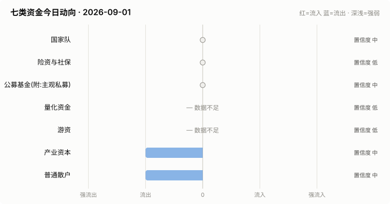

# A股资金动向日报 · 2026-09-01

> 本报告由公开数据自动生成。**方向结论按数据可得性标注置信度**:
> 高=每日硬数据(龙虎榜/公告/两融);中=每日代理指标(行为推断);低=仅低频或间接证据。

> ⚠️ 数据质量提示:本次运行保留了可用字段;缺失字段不补零,备用/历史值不视为当日值。各节中的警告包含具体来源和数据截至日期。

## 一、七类资金动向总览

| 参与者 | 动向 | 置信度 | 一句话解读 |
| --- | --- | --- | --- |
| 国家队 | → 中性 | 中 | 宽基ETF成交平稳,未见国家队明显动作。 |
| 险资与社保 | → 中性 | 低 | 无涉险资/社保公告;险资无每日数据,默认视为中性。 |
| 公募基金(附:主观私募) | ↓ 流出 | 中 | 全市场ETF份额环比 -0.34%(申赎代理);近7天新发权益基金 9亿份。 |
| 量化资金 | ↑ 流入 | 中 | 小微盘成交占比较20日均值偏离 +4.0pp,代理量化策略活跃度变化。 |
| 游资 | ↑ 流入 | 高 | 知名游资席位 6 个上榜,合计净买入 +1.5亿。 |
| 产业资本 | → 中性 | 中 | 净增持家数 -17;回购公告 12 家;大宗溢价成交占比 27%。 |
| 普通散户 | ↑ 流入 | 中 | 沪市融资余额环比 +46亿。 |

**历史趋势(随每日运行更新)**

## 二、分项明细

### 2.1 国家队 — → 中性(置信度:中)

- 宽基ETF成交平稳(放量0只),未见明显护盘迹象。

**汇金系宽基ETF当日成交**

| 代码 | 名称 | 当日成交额 | 相对20日均量 | 涨跌幅 |
| --- | --- | --- | --- | --- |
| 510300 | 华泰柏瑞沪深300ETF | 39.6亿 | 0.89x | -0.02% |
| 510050 | 华夏上证50ETF | 14.0亿 | 0.83x | +0.46% |
| 510500 | 南方中证500ETF | 30.6亿 | 0.90x | -1.08% |
| 159919 | 嘉实沪深300ETF | 10.1亿 | 1.23x | +0.00% |
| 588000 | 华夏科创50ETF | 43.7亿 | 0.53x | -2.08% |
| 512100 | 南方中证1000ETF | 33.7亿 | 0.74x | -0.86% |

### 2.2 险资与社保 — → 中性(置信度:低)

- 当日扫描持股变动公告 44 条,未发现涉险资/社保/举牌关键词。

> ⚠️ 险资/社保没有每日持仓披露:硬数据仅有季报十大流通股东与举牌公告,本节结论置信度恒为低,建议结合季报数据人工复核。

### 2.3 公募基金(附:主观私募) — ↓ 流出(置信度:中)

- 全市场ETF总份额较上一交易日变动 -107.3亿份(净赎回),以此作为公募被动端申赎代理。
- 近7天新成立权益类基金 4 只,合计募集 9.4亿份(反映公募增量资金入场节奏)。

**近7天新成立权益基金(募集前5)**

| 基金代码 | 基金简称 | 基金类型 | 募集份额 | 成立日期 |
| --- | --- | --- | --- | --- |
| 027729 | 财通资管沪深300指数增强A | 指数型-股票 | 4.6 | 2026-08-25 |
| 027730 | 财通资管沪深300指数增强C | 指数型-股票 | 4.6 | 2026-08-25 |
| 028814 | 国泰海通消费服务睿选混合发起C | 混合型-偏股 | 0.1 | 2026-08-28 |
| 028813 | 国泰海通消费服务睿选混合发起A | 混合型-偏股 | 0.1 | 2026-08-28 |

> ⚠️ 主观私募无每日公开持仓/仓位数据,通常仅有第三方月频仓位调查;本报告不对主观私募单独给出每日方向判断。

### 2.4 量化资金 — ↑ 流入(置信度:中)

- 全市场成交 20358亿,其中中证2000成交 4211亿,小微盘成交占比 20.7%,较20日均值(16.7%)偏离 +4.0个百分点。
- 中证2000当日 -0.17%。小微盘成交占比明显上升通常对应量化(高频/微盘策略)活跃度上升,反之为降杠杆或撤退。

> ⚠️ 量化动向为代理推断:公开数据无法区分具体量化策略,仅反映小微盘交易活跃度整体变化。

### 2.5 游资 — ↑ 流入(置信度:高)

- 拉萨系(散户通道)席位当日买入 5.0亿,净买 0.1亿(此项同时作为散户情绪参考)。

**当日龙虎榜净买额前8个股**

| 代码 | 名称 | 收盘价 | 涨跌幅 | 龙虎榜净买额 | 上榜原因 |
| --- | --- | --- | --- | --- | --- |
| 002015 | 协鑫能科 | 17.42 | +9.97% | 4.3亿 | 日涨幅偏离值达到7%的前5只证券 |
| 300189 | 神农种业 | 7.55 | +20.03% | 3.5亿 | 日换手率达到30%的前5只证券 |
| 300413 | 芒果超媒 | 20.38 | +20.02% | 1.9亿 | 日涨幅达到15%的前5只证券 |
| 300927 | 江天化学 | 34.92 | +20.00% | 1.8亿 | 日涨幅达到15%的前5只证券 |
| 300911 | 亿田智能 | 28.98 | +8.82% | 1.5亿 | 连续三个交易日内，涨幅偏离值累计达到30%的证券 |
| 301697 | 贝特利 | 35.9 | +196.69% | 1.2亿 | 无价格涨跌幅限制的证券 |
| 002354 | 天娱数科 | 8.36 | +4.11% | 1.0亿 | 日换手率达到20%的前5只证券 |
| 601123 | 马矿股份 | 26.0 | +290.98% | 1.0亿 | 无价格涨跌幅限制的证券 |

**知名游资席位当日动向**

| 营业部名称 | 买入 | 卖出 | 净额 | 买入股票 |
| --- | --- | --- | --- | --- |
| 国盛证券股份有限公司宁波桑田路证券营业部 | 1.5亿 | 0.5亿 | 0.9亿 | 赤天化 天娱数科 神农种业 |
| 华泰证券股份有限公司深圳益田路荣超商务中心证券营业部 | 0.3亿 | 0.1亿 | 0.3亿 | 马矿股份 华大海天 |
| 东吴证券股份有限公司苏州西北街证券营业部 | 0.4亿 | 0.2亿 | 0.2亿 | 冀衡医药 流金科技 华信永道 浙江大农 绿亨科技 |
| 中国银河证券股份有限公司绍兴鲁迅中路证券营业部 | 0.4亿 | 0.3亿 | 0.2亿 | 青山纸业 冀衡医药 |
| 华鑫证券有限责任公司上海分公司 | 0.0亿 | — | 0.0亿 | 佳禾食品 |
| 东莞证券股份有限公司北京分公司 | 0.0亿 | 0.0亿 | -0.0亿 | 绿亨科技 |

### 2.6 产业资本 — → 中性(置信度:中)

- 当日增持公告 12 家,减持公告 29 家,净增持家数 -17。
- 当日更新回购公告 12 家,披露已回购金额合计 9.0亿。
- 大宗交易成交总额 13.0亿,其中溢价成交占比 26.6%(溢价占比高通常代表主动接盘意愿强)。

> ⚠️ 股东增减持计数采用stock_notice_report 持股变动公告代理(非精确股东变动明细),数据截至 2026-09-01(报告日期 2026-09-01)。

### 2.7 普通散户 — ↑ 流入(置信度:中)

- 全市场融资余额约 26271亿(沪 13475亿 + 深 12796亿),沪市环比 45.8亿。
- 最近披露月份(2023-08)新增投资者 99.59 万户,环比 +9.4%(月频指标;该月度口径中登公司已停止披露,仅作历史参考)。

> ⚠️ 沪市融资余额采用stock_margin_sse,数据截至 2026-08-31(报告日期 2026-09-01,滞后 1 个日历日)。
> ⚠️ 沪市融资买入额采用stock_margin_sse,数据截至 2026-08-31(报告日期 2026-09-01,滞后 1 个日历日)。
> ⚠️ 深市融资余额采用stock_margin_szse,数据截至 2026-08-31(报告日期 2026-09-01,滞后 1 个日历日)。
> ⚠️ 深市融资买入额采用stock_margin_szse,数据截至 2026-08-31(报告日期 2026-09-01,滞后 1 个日历日)。
> ⚠️ 个股资金流排行、大盘资金流代理及短期历史快照均不可用,小单口径缺失。

## 三、个股杠杆监测

- 当日两融资金参与度(融资买入额/两市成交额)约 9.38%,较20日均值(9.3%)偏离 +0.1个百分点(比例越高说明当日交易中加杠杆买入的比重越大,市场波动风险通常也更高)。
- 国家队(汇金系宽基ETF)历来是现金申购,不使用融资杠杆,因此没有可比的每日"国家队杠杆"数字;下面的杠杆水位与排行反映的主要是散户与游资的两融行为。
- 当日纳入统计的3269只个股中,234只融资余额占流通市值超过8%(阈值见 config.yaml);建议持有这类个股时使用更紧的止损比例(参考仓位/止损计算器,该工具支持按代码查询个股杠杆水位)。

**个股杠杆最集中(前15只,2026-08-31两融数据)**

| 代码 | 名称 | 融资买入占成交额% | 融资余额占流通市值% | 当日涨跌幅% | 当日振幅% |
| --- | --- | --- | --- | --- | --- |
| 688325 | 赛微微电 | 46.55 | 4.82 | -2.2 | 4.95 |
| 000932 | 华菱钢铁 | 41.82 | 4.05 | 1.65 | 2.2 |
| 688678 | 福立旺 | 40.57 | 7.73 | -1.7 | 5.14 |
| 688267 | 中触媒 | 38.95 | 7.85 | -2.58 | 3.79 |
| 301327 | 华宝新能 | 38.91 | 2.72 | 1.01 | 1.88 |
| 600048 | 保利发展 | 36.25 | 5.24 | -1.41 | 2.62 |
| 688621 | 阳光诺和 | 35.96 | 5.29 | -1.87 | 3.59 |
| 688581 | 安杰思 | 32.51 | 6.24 | 0.1 | 0.61 |
| 000036 | 华联控股 | 29.6 | 5.92 | -1.23 | 3.21 |
| 603776 | 永安行 | 29.41 | 8.85 | 1.36 | 2.23 |
| 600765 | 中航重机 | 29.12 | 5.19 | 0.3 | 2.11 |
| 688479 | 友车科技 | 29.12 | 7.91 | -3.3 | 5.6 |
| 300737 | 科顺股份 | 29.06 | 6.15 | 0.2 | 2.66 |
| 688629 | 华丰科技 | 28.58 | 2.99 | -4.27 | 4.44 |
| 301379 | 天山电子 | 28.12 | 7.35 | -2.74 | 4.47 |

> ⚠️ 沪市融资买入额采用stock_margin_sse,数据截至 2026-08-31(报告日期 2026-09-01,滞后 1 个日历日)。
> ⚠️ 深市融资买入额采用stock_margin_szse,数据截至 2026-08-31(报告日期 2026-09-01,滞后 1 个日历日)。
> ⚠️ 实时行情快照主源不可用,本次排行采用腾讯备用源(数据截至 2026-09-01)。

## 四、数据说明与局限

- 国家队动向为行为推断(宽基ETF放量+指数走势组合),非官方口径;确认需等季报十大股东。
- 险资/社保、主观私募无每日公开数据,相关结论置信度恒为低。
- 量化动向以小微盘成交占比为代理,只反映整体活跃度,无法区分具体策略。
- 游资识别依赖 config.yaml 中的席位关键词表,存在漏配;拉萨系席位计为散户通道。
- 两融、龙虎榜等数据为 T+1 或盘后披露,个别接口更新时间不一。
- 个股杠杆排行剔除了流通市值过小的个股(阈值见 config.yaml),融资余额/买入额与当日行情存在披露时点差异,仅作参考,不构成个股推荐。
> ⚠️ 本报告含缺失、备用或历史快照数据;每条降级数字均按“数据截至 YYYY-MM-DD”标注真实新鲜度。

**本次运行的数据质量明细:**
- 产业资本: 股东增减持计数采用stock_notice_report 持股变动公告代理(非精确股东变动明细),数据截至 2026-09-01(报告日期 2026-09-01)。
- 普通散户: 沪市融资余额采用stock_margin_sse,数据截至 2026-08-31(报告日期 2026-09-01,滞后 1 个日历日)。
- 普通散户: 沪市融资买入额采用stock_margin_sse,数据截至 2026-08-31(报告日期 2026-09-01,滞后 1 个日历日)。
- 普通散户: 深市融资余额采用stock_margin_szse,数据截至 2026-08-31(报告日期 2026-09-01,滞后 1 个日历日)。
- 普通散户: 深市融资买入额采用stock_margin_szse,数据截至 2026-08-31(报告日期 2026-09-01,滞后 1 个日历日)。
- 普通散户: 个股资金流排行、大盘资金流代理及短期历史快照均不可用,小单口径缺失。
- 个股杠杆监测: 沪市融资买入额采用stock_margin_sse,数据截至 2026-08-31(报告日期 2026-09-01,滞后 1 个日历日)。
- 个股杠杆监测: 深市融资买入额采用stock_margin_szse,数据截至 2026-08-31(报告日期 2026-09-01,滞后 1 个日历日)。
- 个股杠杆监测: 实时行情快照主源不可用,本次排行采用腾讯备用源(数据截至 2026-09-01)。

**本次运行失败的数据源:**
- stock_ggcg_em: TimeoutError: 
- stock_ggcg_em: TimeoutError: 
- stock_margin_szse: ValueError: Length mismatch: Expected axis has 0 elements, new values have 6 elements
- stock_individual_fund_flow_rank: JSONDecodeError: Expecting value: line 1 column 1 (char 0)
- stock_market_fund_flow: ConnectionError: ('Connection aborted.', RemoteDisconnected('Remote end closed connection without response'))
- stock_margin_detail_sse: ValueError: Length mismatch: Expected axis has 0 elements, new values have 13 elements
- stock_zh_a_spot_em: ConnectionError: ('Connection aborted.', RemoteDisconnected('Remote end closed connection without response'))
