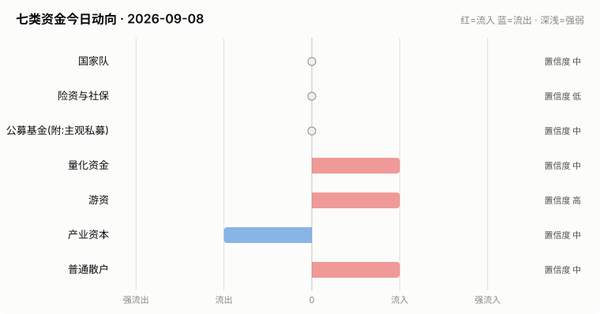

# A股资金动向日报 · 2026-09-08

> 本报告由公开数据自动生成。**方向结论按数据可得性标注置信度**:
> 高=每日硬数据(龙虎榜/公告/两融);中=每日代理指标(行为推断);低=仅低频或间接证据。

> ⚠️ 数据质量提示:本次运行保留了可用字段;缺失字段不补零,备用/历史值不视为当日值。各节中的警告包含具体来源和数据截至日期。

## 一、七类资金动向总览

| 参与者 | 动向 | 置信度 | 一句话解读 |
| --- | --- | --- | --- |
| 国家队 | → 中性 | 中 | 宽基ETF成交平稳,未见国家队明显动作。 |
| 险资与社保 | → 中性 | 低 | 无涉险资/社保公告;险资无每日数据,默认视为中性。 |
| 公募基金(附:主观私募) | → 中性 | 中 | 全市场ETF份额环比 -0.19%(申赎代理);近7天新发权益基金 1亿份。 |
| 量化资金 | ↑ 流入 | 中 | 小微盘成交占比较20日均值偏离 +3.8pp,代理量化策略活跃度变化。 |
| 游资 | ↑ 流入 | 高 | 知名游资席位 5 个上榜,合计净买入 +0.8亿。 |
| 产业资本 | ↓ 流出 | 中 | 净增持家数 -27;回购公告 10 家;大宗溢价成交占比 8%。 |
| 普通散户 | ↑ 流入 | 中 | 沪市融资余额环比 +78亿。 |

**历史趋势(随每日运行更新)**

## 二、分项明细

### 2.1 国家队 — → 中性(置信度:中)

- 宽基ETF成交平稳(放量0只),未见明显护盘迹象。

**汇金系宽基ETF当日成交**

| 代码 | 名称 | 当日成交额 | 相对20日均量 | 涨跌幅 |
| --- | --- | --- | --- | --- |
| 510300 | 华泰柏瑞沪深300ETF | 28.4亿 | 0.75x | -0.22% |
| 510050 | 华夏上证50ETF | 9.8亿 | 0.66x | -0.03% |
| 510500 | 南方中证500ETF | 22.5亿 | 0.76x | +0.22% |
| 159919 | 嘉实沪深300ETF | 6.2亿 | 0.85x | -0.31% |
| 588000 | 华夏科创50ETF | 50.2亿 | 0.78x | -1.41% |
| 512100 | 南方中证1000ETF | 25.0亿 | 0.66x | +0.29% |

### 2.2 险资与社保 — → 中性(置信度:低)

- 当日扫描持股变动公告 51 条,未发现涉险资/社保/举牌关键词。

> ⚠️ 险资/社保没有每日持仓披露:硬数据仅有季报十大流通股东与举牌公告,本节结论置信度恒为低,建议结合季报数据人工复核。

### 2.3 公募基金(附:主观私募) — → 中性(置信度:中)

- 全市场ETF总份额较上一交易日变动 -61.2亿份(净赎回),以此作为公募被动端申赎代理。
- 近7天新成立权益类基金 4 只,合计募集 0.9亿份(反映公募增量资金入场节奏)。

**近7天新成立权益基金(募集前5)**

| 基金代码 | 基金简称 | 基金类型 | 募集份额 | 成立日期 |
| --- | --- | --- | --- | --- |
| 028229 | 长城安瑞混合发起A | 混合型-偏债 | 0.33 | 2026-09-03 |
| 028230 | 长城安瑞混合发起C | 混合型-偏债 | 0.33 | 2026-09-03 |
| 028582 | 天弘中证稀有金属主题指数发起C | 指数型-股票 | 0.11 | 2026-09-01 |
| 028581 | 天弘中证稀有金属主题指数发起A | 指数型-股票 | 0.11 | 2026-09-01 |

> ⚠️ 主观私募无每日公开持仓/仓位数据,通常仅有第三方月频仓位调查;本报告不对主观私募单独给出每日方向判断。

### 2.4 量化资金 — ↑ 流入(置信度:中)

- 全市场成交 19623亿,其中中证2000成交 4254亿,小微盘成交占比 21.7%,较20日均值(17.9%)偏离 +3.8个百分点。
- 中证2000当日 +0.55%。小微盘成交占比明显上升通常对应量化(高频/微盘策略)活跃度上升,反之为降杠杆或撤退。

> ⚠️ 量化动向为代理推断:公开数据无法区分具体量化策略,仅反映小微盘交易活跃度整体变化。

### 2.5 游资 — ↑ 流入(置信度:高)

- 拉萨系(散户通道)席位当日买入 3.7亿,净买 1.1亿(此项同时作为散户情绪参考)。

**当日龙虎榜净买额前8个股**

| 代码 | 名称 | 收盘价 | 涨跌幅 | 龙虎榜净买额 | 上榜原因 |
| --- | --- | --- | --- | --- | --- |
| 000620 | 盈新发展 | 3.32 | +9.93% | 4.2亿 | 日涨幅偏离值达到7%的前5只证券 |
| 002579 | 中京电子 | 17.06 | +9.99% | 3.5亿 | 连续三个交易日内，涨幅偏离值累计达到20%的证券 |
| 603991 | 领先股份 | 177.42 | +6.01% | 2.6亿 | 非S证券连续三个交易日内收盘价格涨幅偏离值累计达到20%的证券 |
| 002827 | 高争民爆 | 64.15 | -9.71% | 2.3亿 | 日跌幅偏离值达到7%的前5只证券 |
| 002470 | 金正大 | 2.53 | +10.00% | 2.1亿 | 连续三个交易日内，涨幅偏离值累计达到20%的证券 |
| 600127 | 金健米业 | 14.79 | +9.31% | 1.6亿 | 有价格涨跌幅限制的日换手率达到20%的前五只证券 |
| 000833 | 粤桂股份 | 22.83 | +10.02% | 1.4亿 | 日涨幅偏离值达到7%的前5只证券 |
| 300788 | 中信出版 | 31.75 | +19.99% | 1.1亿 | 日涨幅达到15%的前5只证券 |

**知名游资席位当日动向**

| 营业部名称 | 买入 | 卖出 | 净额 | 买入股票 |
| --- | --- | --- | --- | --- |
| 中信证券股份有限公司上海溧阳路证券营业部 | 0.5亿 | 0.0亿 | 0.5亿 | 华盛昌 |
| 中国银河证券股份有限公司绍兴鲁迅中路证券营业部 | 0.2亿 | — | 0.2亿 | 百大集团 |
| 东吴证券股份有限公司苏州西北街证券营业部 | 0.2亿 | 0.0亿 | 0.2亿 | 欧福蛋业 |
| 国盛证券股份有限公司宁波桑田路证券营业部 | — | 0.0亿 | -0.0亿 | 百大集团 |
| 华泰证券股份有限公司深圳益田路荣超商务中心证券营业部 | 0.1亿 | 0.2亿 | -0.0亿 | 马矿股份 |

### 2.6 产业资本 — ↓ 流出(置信度:中)

- 当日增持公告 10 家,减持公告 37 家,净增持家数 -27。
- 当日更新回购公告 10 家,披露已回购金额合计 4.7亿。
- 大宗交易成交总额 9.5亿,其中溢价成交占比 8.3%(溢价占比高通常代表主动接盘意愿强)。

> ⚠️ 股东增减持计数采用stock_notice_report 持股变动公告代理(非精确股东变动明细),数据截至 2026-09-08(报告日期 2026-09-08)。

### 2.7 普通散户 — ↑ 流入(置信度:中)

- 全市场融资余额约 26123亿(沪 13394亿 + 深 12729亿),沪市环比 78.0亿。
- 最近披露月份(2023-08)新增投资者 99.59 万户,环比 +9.4%(月频指标;该月度口径中登公司已停止披露,仅作历史参考)。

> ⚠️ 沪市融资余额采用stock_margin_sse,数据截至 2026-09-07(报告日期 2026-09-08,滞后 1 个日历日)。
> ⚠️ 沪市融资买入额采用stock_margin_sse,数据截至 2026-09-07(报告日期 2026-09-08,滞后 1 个日历日)。
> ⚠️ 深市融资余额采用stock_margin_szse,数据截至 2026-09-07(报告日期 2026-09-08,滞后 1 个日历日)。
> ⚠️ 深市融资买入额采用stock_margin_szse,数据截至 2026-09-07(报告日期 2026-09-08,滞后 1 个日历日)。
> ⚠️ 个股资金流排行、大盘资金流代理及短期历史快照均不可用,小单口径缺失。

## 三、个股杠杆监测

- 当日两融资金参与度(融资买入额/两市成交额)约 8.87%,较20日均值(9.2%)偏离 -0.3个百分点(比例越高说明当日交易中加杠杆买入的比重越大,市场波动风险通常也更高)。
- 国家队(汇金系宽基ETF)历来是现金申购,不使用融资杠杆,因此没有可比的每日"国家队杠杆"数字;下面的杠杆水位与排行反映的主要是散户与游资的两融行为。
- 当日纳入统计的3260只个股中,245只融资余额占流通市值超过8%(阈值见 config.yaml);建议持有这类个股时使用更紧的止损比例(参考仓位/止损计算器,该工具支持按代码查询个股杠杆水位)。

**个股杠杆最集中(前15只,2026-09-07两融数据)**

| 代码 | 名称 | 融资买入占成交额% | 融资余额占流通市值% | 当日涨跌幅% | 当日振幅% |
| --- | --- | --- | --- | --- | --- |
| 301379 | 天山电子 | 41.95 | 7.46 | -0.95 | 3.21 |
| 600529 | 山东药玻 | 38.93 | 5.52 | 0.37 | 1.12 |
| 002036 | 联创电子 | 38.3 | 8.91 | -1.02 | 1.9 |
| 600167 | 联美控股 | 36.65 | 4.52 | -0.34 | 1.71 |
| 603035 | 常熟汽饰 | 36.64 | 8.51 | 0.83 | 1.48 |
| 688416 | 恒烁股份 | 36.51 | 7.14 | -1.38 | 5.05 |
| 603867 | 新化股份 | 35.91 | 7.72 | 0.33 | 2.5 |
| 000623 | 吉林敖东 | 35.08 | 6.5 | 0.66 | 0.88 |
| 000683 | 博源化工 | 32.95 | 4.3 | 1.3 | 2.27 |
| 301178 | 天亿马 | 32.23 | 8.13 | -1.88 | 3.28 |
| 600926 | 杭州银行 | 32.08 | 1.97 | 0.94 | 1.41 |
| 600218 | 全柴动力 | 31.93 | 8.53 | 0.0 | 1.26 |
| 688330 | 宏力达 | 30.96 | 4.32 | -0.3 | 1.36 |
| 688799 | 华纳药厂 | 30.44 | 3.85 | 0.96 | 2.71 |
| 688161 | 威高骨科 | 30.36 | 1.84 | -0.88 | 1.24 |

> ⚠️ 沪市融资买入额采用stock_margin_sse,数据截至 2026-09-07(报告日期 2026-09-08,滞后 1 个日历日)。
> ⚠️ 深市融资买入额采用stock_margin_szse,数据截至 2026-09-07(报告日期 2026-09-08,滞后 1 个日历日)。
> ⚠️ 实时行情快照主源不可用,本次排行采用腾讯备用源(数据截至 2026-09-08)。

## 四、数据说明与局限

- 国家队动向为行为推断(宽基ETF放量+指数走势组合),非官方口径;确认需等季报十大股东。
- 险资/社保、主观私募无每日公开数据,相关结论置信度恒为低。
- 量化动向以小微盘成交占比为代理,只反映整体活跃度,无法区分具体策略。
- 游资识别依赖 config.yaml 中的席位关键词表,存在漏配;拉萨系席位计为散户通道。
- 两融、龙虎榜等数据为 T+1 或盘后披露,个别接口更新时间不一。
- 个股杠杆排行剔除了流通市值过小的个股(阈值见 config.yaml),融资余额/买入额与当日行情存在披露时点差异,仅作参考,不构成个股推荐。
> ⚠️ 本报告含缺失、备用或历史快照数据;每条降级数字均按“数据截至 YYYY-MM-DD”标注真实新鲜度。

**本次运行的数据质量明细:**
- 产业资本: 股东增减持计数采用stock_notice_report 持股变动公告代理(非精确股东变动明细),数据截至 2026-09-08(报告日期 2026-09-08)。
- 普通散户: 沪市融资余额采用stock_margin_sse,数据截至 2026-09-07(报告日期 2026-09-08,滞后 1 个日历日)。
- 普通散户: 沪市融资买入额采用stock_margin_sse,数据截至 2026-09-07(报告日期 2026-09-08,滞后 1 个日历日)。
- 普通散户: 深市融资余额采用stock_margin_szse,数据截至 2026-09-07(报告日期 2026-09-08,滞后 1 个日历日)。
- 普通散户: 深市融资买入额采用stock_margin_szse,数据截至 2026-09-07(报告日期 2026-09-08,滞后 1 个日历日)。
- 普通散户: 个股资金流排行、大盘资金流代理及短期历史快照均不可用,小单口径缺失。
- 个股杠杆监测: 沪市融资买入额采用stock_margin_sse,数据截至 2026-09-07(报告日期 2026-09-08,滞后 1 个日历日)。
- 个股杠杆监测: 深市融资买入额采用stock_margin_szse,数据截至 2026-09-07(报告日期 2026-09-08,滞后 1 个日历日)。
- 个股杠杆监测: 实时行情快照主源不可用,本次排行采用腾讯备用源(数据截至 2026-09-08)。

**本次运行失败的数据源:**
- stock_ggcg_em: TimeoutError: 
- stock_ggcg_em: TimeoutError: 
- stock_margin_szse: ValueError: Length mismatch: Expected axis has 0 elements, new values have 6 elements
- stock_individual_fund_flow_rank: JSONDecodeError: Expecting value: line 1 column 1 (char 0)
- stock_market_fund_flow: ConnectionError: ('Connection aborted.', RemoteDisconnected('Remote end closed connection without response'))
- stock_margin_detail_sse: ValueError: Length mismatch: Expected axis has 0 elements, new values have 13 elements
- stock_zh_a_spot_em: ConnectionError: ('Connection aborted.', RemoteDisconnected('Remote end closed connection without response'))
