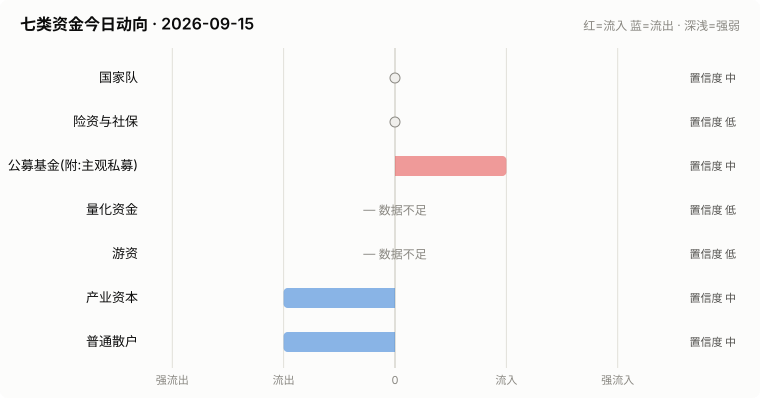

# A股资金动向日报 · 2026-09-15

> 本报告由公开数据自动生成。**方向结论按数据可得性标注置信度**:
> 高=每日硬数据(龙虎榜/公告/两融);中=每日代理指标(行为推断);低=仅低频或间接证据。

> ⚠️ 数据质量提示:本次运行保留了可用字段;缺失字段不补零,备用/历史值不视为当日值。各节中的警告包含具体来源和数据截至日期。

## 一、七类资金动向总览

| 参与者 | 动向 | 置信度 | 一句话解读 |
| --- | --- | --- | --- |
| 国家队 | → 中性 | 中 | 宽基ETF成交平稳,未见国家队明显动作。 |
| 险资与社保 | → 中性 | 低 | 无涉险资/社保公告;险资无每日数据,默认视为中性。 |
| 公募基金(附:主观私募) | ↑ 流入 | 中 | 全市场ETF份额环比 +0.53%(申赎代理);近7天新发权益基金 6亿份。 |
| 量化资金 | ↑ 流入 | 中 | 小微盘成交占比较20日均值偏离 +3.7pp,代理量化策略活跃度变化。 |
| 游资 | ↓ 流出 | 高 | 知名游资席位 5 个上榜,合计净买入 -1.3亿。 |
| 产业资本 | ↓↓ 大幅流出 | 中 | 净增持家数 -24;回购公告 9 家;大宗溢价成交占比 2%。 |
| 普通散户 | → 中性 | 中 | 沪市融资余额环比 -27亿。 |

**历史趋势(随每日运行更新)**

## 二、分项明细

### 2.1 国家队 — → 中性(置信度:中)

- 宽基ETF成交平稳(放量0只),未见明显护盘迹象。

**汇金系宽基ETF当日成交**

| 代码 | 名称 | 当日成交额 | 相对20日均量 | 涨跌幅 |
| --- | --- | --- | --- | --- |
| 510300 | 华泰柏瑞沪深300ETF | 31.6亿 | 0.85x | -0.64% |
| 510050 | 华夏上证50ETF | 12.6亿 | 0.87x | -0.60% |
| 510500 | 南方中证500ETF | 31.7亿 | 1.09x | -0.13% |
| 159919 | 嘉实沪深300ETF | 4.6亿 | 0.65x | -0.72% |
| 588000 | 华夏科创50ETF | 60.4亿 | 0.99x | +1.55% |
| 512100 | 南方中证1000ETF | 15.3亿 | 0.48x | -0.30% |

### 2.2 险资与社保 — → 中性(置信度:低)

- 当日扫描持股变动公告 43 条,未发现涉险资/社保/举牌关键词。

> ⚠️ 险资/社保没有每日持仓披露:硬数据仅有季报十大流通股东与举牌公告,本节结论置信度恒为低,建议结合季报数据人工复核。

### 2.3 公募基金(附:主观私募) — ↑ 流入(置信度:中)

- 全市场ETF总份额较上一交易日变动 +169.2亿份(净申购),以此作为公募被动端申赎代理。
- 近7天新成立权益类基金 8 只,合计募集 5.7亿份(反映公募增量资金入场节奏)。

**近7天新成立权益基金(募集前5)**

| 基金代码 | 基金简称 | 基金类型 | 募集份额 | 成立日期 |
| --- | --- | --- | --- | --- |
| 027735 | 天弘上证科创板芯片指数C | 指数型-股票 | 2.35 | 2026-09-09 |
| 027734 | 天弘上证科创板芯片指数A | 指数型-股票 | 2.35 | 2026-09-09 |
| 028899 | 银华国证新能源电池ETF发起式联接C | 指数型-股票 | 0.16 | 2026-09-08 |
| 028898 | 银华国证新能源电池ETF发起式联接A | 指数型-股票 | 0.16 | 2026-09-08 |
| 028292 | 泰信周期轮动锐选混合发起式C | 混合型-偏股 | 0.16 | 2026-09-08 |

> ⚠️ 主观私募无每日公开持仓/仓位数据,通常仅有第三方月频仓位调查;本报告不对主观私募单独给出每日方向判断。

### 2.4 量化资金 — ↑ 流入(置信度:中)

- 全市场成交 16143亿,其中中证2000成交 3725亿,小微盘成交占比 23.1%,较20日均值(19.3%)偏离 +3.7个百分点。
- 中证2000当日 -1.16%。小微盘成交占比明显上升通常对应量化(高频/微盘策略)活跃度上升,反之为降杠杆或撤退。

> ⚠️ 量化动向为代理推断:公开数据无法区分具体量化策略,仅反映小微盘交易活跃度整体变化。

### 2.5 游资 — ↓ 流出(置信度:高)

- 拉萨系(散户通道)席位当日买入 7.2亿,净买 1.7亿(此项同时作为散户情绪参考)。

**当日龙虎榜净买额前8个股**

| 代码 | 名称 | 收盘价 | 涨跌幅 | 龙虎榜净买额 | 上榜原因 |
| --- | --- | --- | --- | --- | --- |
| 002491 | 通鼎互联 | 22.23 | +10.00% | 8.4亿 | 日涨幅偏离值达到7%的前5只证券 |
| 002212 | 天融信 | 7.77 | +5.00% | 2.0亿 | 连续三个交易日内，涨幅偏离值累计达到20%的证券 |
| 002585 | 双星新材 | 12.06 | +10.04% | 1.9亿 | 日涨幅偏离值达到7%的前5只证券 |
| 002487 | 大金重工 | 39.44 | +10.01% | 1.2亿 | 日涨幅偏离值达到7%的前5只证券 |
| 002897 | 意华股份 | 74.99 | +5.04% | 1.1亿 | 连续三个交易日内，涨幅偏离值累计达到20%的证券 |
| 002531 | 天顺风能 | 7.81 | +10.00% | 1.1亿 | 日振幅值达到15%的前5只证券 |
| 000823 | 超声电子 | 23.9 | +5.61% | 0.9亿 | 日换手率达到20%的前5只证券 |
| 603270 | 金帝股份 | 34.47 | +4.77% | 0.8亿 | 有价格涨跌幅限制的日换手率达到20%的前五只证券 |

**知名游资席位当日动向**

| 营业部名称 | 买入 | 卖出 | 净额 | 买入股票 |
| --- | --- | --- | --- | --- |
| 东方证券股份有限公司上海浦东新区源深路证券营业部 | 0.1亿 | — | 0.1亿 | 和顺石油 |
| 国盛证券股份有限公司宁波桑田路证券营业部 | 0.8亿 | 0.8亿 | -0.0亿 | 大金重工 金健米业 敦煌种业 万向德农 |
| 华鑫证券有限责任公司上海分公司 | 0.1亿 | 0.2亿 | -0.2亿 | 启明信息 万邦医药 |
| 华泰证券股份有限公司深圳益田路荣超商务中心证券营业部 | — | 0.3亿 | -0.3亿 | 马矿股份 |
| 中信证券股份有限公司上海虹口区溧阳路证券营业部 | 0.0亿 | 1.0亿 | -1.0亿 | ST荣科 远东股份 |

### 2.6 产业资本 — ↓↓ 大幅流出(置信度:中)

- 当日增持公告 7 家,减持公告 31 家,净增持家数 -24。
- 当日更新回购公告 9 家,披露已回购金额合计 7.4亿。
- 大宗交易成交总额 7.7亿,其中溢价成交占比 1.8%(溢价占比高通常代表主动接盘意愿强)。

> ⚠️ 股东增减持计数采用stock_notice_report 持股变动公告代理(非精确股东变动明细),数据截至 2026-09-15(报告日期 2026-09-15)。

### 2.7 普通散户 — → 中性(置信度:中)

- 全市场融资余额约 25893亿(沪 13284亿 + 深 12610亿),沪市环比 -26.9亿。
- 最近披露月份(2023-08)新增投资者 99.59 万户,环比 +9.4%(月频指标;该月度口径中登公司已停止披露,仅作历史参考)。

> ⚠️ 沪市融资余额采用stock_margin_sse,数据截至 2026-09-14(报告日期 2026-09-15,滞后 1 个日历日)。
> ⚠️ 沪市融资买入额采用stock_margin_sse,数据截至 2026-09-14(报告日期 2026-09-15,滞后 1 个日历日)。
> ⚠️ 深市融资余额采用stock_margin_szse,数据截至 2026-09-14(报告日期 2026-09-15,滞后 1 个日历日)。
> ⚠️ 深市融资买入额采用stock_margin_szse,数据截至 2026-09-14(报告日期 2026-09-15,滞后 1 个日历日)。
> ⚠️ 个股资金流排行、大盘资金流代理及短期历史快照均不可用,小单口径缺失。

## 三、个股杠杆监测

- 当日两融资金参与度(融资买入额/两市成交额)约 8.04%,较20日均值(9.1%)偏离 -1.0个百分点(比例越高说明当日交易中加杠杆买入的比重越大,市场波动风险通常也更高)。
- 国家队(汇金系宽基ETF)历来是现金申购,不使用融资杠杆,因此没有可比的每日"国家队杠杆"数字;下面的杠杆水位与排行反映的主要是散户与游资的两融行为。
- 当日纳入统计的3237只个股中,292只融资余额占流通市值超过8%(阈值见 config.yaml);建议持有这类个股时使用更紧的止损比例(参考仓位/止损计算器,该工具支持按代码查询个股杠杆水位)。

**个股杠杆最集中(前15只,2026-09-14两融数据)**

| 代码 | 名称 | 融资买入占成交额% | 融资余额占流通市值% | 当日涨跌幅% | 当日振幅% |
| --- | --- | --- | --- | --- | --- |
| 000707 | 双环科技 | 42.83 | 5.82 | -3.07 | 3.29 |
| 688171 | 纬德信息 | 36.31 | 3.92 | -3.04 | 7.12 |
| 688071 | 华依科技 | 35.93 | 4.65 | -1.6 | 2.92 |
| 603668 | 天马科技 | 34.11 | 14.27 | -0.49 | 3.02 |
| 688580 | 伟思医疗 | 34.09 | 4.69 | 0.0 | 1.27 |
| 600157 | 永泰能源 | 33.62 | 4.06 | -0.65 | 1.31 |
| 002860 | 星帅尔 | 33.24 | 11.16 | -2.88 | 3.63 |
| 688585 | 上纬新材 | 32.64 | 1.05 | -1.51 | 2.59 |
| 600010 | 包钢股份 | 30.85 | 3.89 | -0.47 | 1.42 |
| 603039 | 泛微网络 | 30.63 | 6.23 | 0.36 | 2.44 |
| 002161 | 远 望 谷 | 29.41 | 9.54 | -9.94 | 3.04 |
| 001380 | 华纬科技 | 29.39 | 2.99 | -1.15 | 1.59 |
| 688381 | 帝奥微 | 29.18 | 4.82 | -2.45 | 4.44 |
| 688296 | 和达科技 | 28.52 | 4.38 | 1.73 | 5.15 |
| 688569 | 铁科轨道 | 28.24 | 2.25 | -1.35 | 2.22 |

> ⚠️ 沪市融资买入额采用stock_margin_sse,数据截至 2026-09-14(报告日期 2026-09-15,滞后 1 个日历日)。
> ⚠️ 深市融资买入额采用stock_margin_szse,数据截至 2026-09-14(报告日期 2026-09-15,滞后 1 个日历日)。
> ⚠️ 实时行情快照主源不可用,本次排行采用腾讯备用源(数据截至 2026-09-15)。

## 四、数据说明与局限

- 国家队动向为行为推断(宽基ETF放量+指数走势组合),非官方口径;确认需等季报十大股东。
- 险资/社保、主观私募无每日公开数据,相关结论置信度恒为低。
- 量化动向以小微盘成交占比为代理,只反映整体活跃度,无法区分具体策略。
- 游资识别依赖 config.yaml 中的席位关键词表,存在漏配;拉萨系席位计为散户通道。
- 两融、龙虎榜等数据为 T+1 或盘后披露,个别接口更新时间不一。
- 个股杠杆排行剔除了流通市值过小的个股(阈值见 config.yaml),融资余额/买入额与当日行情存在披露时点差异,仅作参考,不构成个股推荐。
> ⚠️ 本报告含缺失、备用或历史快照数据;每条降级数字均按“数据截至 YYYY-MM-DD”标注真实新鲜度。

**本次运行的数据质量明细:**
- 产业资本: 股东增减持计数采用stock_notice_report 持股变动公告代理(非精确股东变动明细),数据截至 2026-09-15(报告日期 2026-09-15)。
- 普通散户: 沪市融资余额采用stock_margin_sse,数据截至 2026-09-14(报告日期 2026-09-15,滞后 1 个日历日)。
- 普通散户: 沪市融资买入额采用stock_margin_sse,数据截至 2026-09-14(报告日期 2026-09-15,滞后 1 个日历日)。
- 普通散户: 深市融资余额采用stock_margin_szse,数据截至 2026-09-14(报告日期 2026-09-15,滞后 1 个日历日)。
- 普通散户: 深市融资买入额采用stock_margin_szse,数据截至 2026-09-14(报告日期 2026-09-15,滞后 1 个日历日)。
- 普通散户: 个股资金流排行、大盘资金流代理及短期历史快照均不可用,小单口径缺失。
- 个股杠杆监测: 沪市融资买入额采用stock_margin_sse,数据截至 2026-09-14(报告日期 2026-09-15,滞后 1 个日历日)。
- 个股杠杆监测: 深市融资买入额采用stock_margin_szse,数据截至 2026-09-14(报告日期 2026-09-15,滞后 1 个日历日)。
- 个股杠杆监测: 实时行情快照主源不可用,本次排行采用腾讯备用源(数据截至 2026-09-15)。

**本次运行失败的数据源:**
- stock_ggcg_em: TimeoutError: 
- stock_ggcg_em: TimeoutError: 
- stock_margin_szse: ValueError: Length mismatch: Expected axis has 0 elements, new values have 6 elements
- stock_individual_fund_flow_rank: JSONDecodeError: Expecting value: line 1 column 1 (char 0)
- stock_market_fund_flow: ConnectionError: ('Connection aborted.', RemoteDisconnected('Remote end closed connection without response'))
- stock_margin_detail_sse: ValueError: Length mismatch: Expected axis has 0 elements, new values have 13 elements
- stock_zh_a_spot_em: ConnectionError: ('Connection aborted.', RemoteDisconnected('Remote end closed connection without response'))
