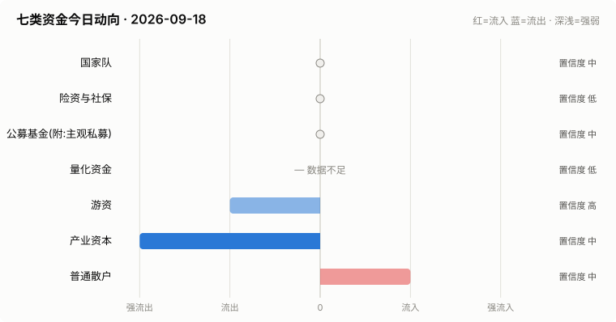

# A股资金动向日报 · 2026-09-18

> 本报告由公开数据自动生成。**方向结论按数据可得性标注置信度**:
> 高=每日硬数据(龙虎榜/公告/两融);中=每日代理指标(行为推断);低=仅低频或间接证据。

> ⚠️ 数据质量提示:本次运行保留了可用字段;缺失字段不补零,备用/历史值不视为当日值。各节中的警告包含具体来源和数据截至日期。

## 一、七类资金动向总览

| 参与者 | 动向 | 置信度 | 一句话解读 |
| --- | --- | --- | --- |
| 国家队 | → 中性 | 中 | 宽基ETF成交平稳,未见国家队明显动作。 |
| 险资与社保 | → 中性 | 低 | 无涉险资/社保公告;险资无每日数据,默认视为中性。 |
| 公募基金(附:主观私募) | → 中性 | 中 | 全市场ETF份额环比 -0.05%(申赎代理);近7天新发权益基金 0亿份。 |
| 量化资金 | — 数据不足 | 低 | 指数数据缺失,无法计算小微盘成交占比。 |
| 游资 | ↓ 流出 | 高 | 知名游资席位 2 个上榜,合计净买入 -1.8亿。 |
| 产业资本 | ↓↓ 大幅流出 | 中 | 净增持家数 -16;回购公告 12 家;大宗溢价成交占比 0%。 |
| 普通散户 | ↑ 流入 | 中 | 沪市融资余额环比 +48亿。 |

**历史趋势(随每日运行更新)**

## 二、分项明细

### 2.1 国家队 — → 中性(置信度:中)

- 宽基ETF成交平稳(放量0只),未见明显护盘迹象。

**汇金系宽基ETF当日成交**

| 代码 | 名称 | 当日成交额 | 相对20日均量 | 涨跌幅 |
| --- | --- | --- | --- | --- |
| 510300 | 华泰柏瑞沪深300ETF | 28.8亿 | 0.81x | +1.10% |
| 510050 | 华夏上证50ETF | 14.4亿 | 0.96x | +0.57% |
| 510500 | 南方中证500ETF | 32.8亿 | 1.07x | +1.94% |
| 159919 | 嘉实沪深300ETF | 5.9亿 | 0.87x | +1.01% |
| 588000 | 华夏科创50ETF | 80.2亿 | 1.33x | +2.83% |
| 512100 | 南方中证1000ETF | 26.5亿 | 0.86x | +2.05% |

### 2.2 险资与社保 — → 中性(置信度:低)

- 当日扫描持股变动公告 34 条,未发现涉险资/社保/举牌关键词。

> ⚠️ 险资/社保没有每日持仓披露:硬数据仅有季报十大流通股东与举牌公告,本节结论置信度恒为低,建议结合季报数据人工复核。

### 2.3 公募基金(附:主观私募) — → 中性(置信度:中)

- 全市场ETF总份额较上一交易日变动 -14.9亿份(净赎回),以此作为公募被动端申赎代理。
- 近7天新成立权益类基金 4 只,合计募集 0.4亿份(反映公募增量资金入场节奏)。

**近7天新成立权益基金(募集前5)**

| 基金代码 | 基金简称 | 基金类型 | 募集份额 | 成立日期 |
| --- | --- | --- | --- | --- |
| 028934 | 华夏中证港股通信息技术综合ETF发起式联接A | 指数型-股票 | 0.11 | 2026-09-11 |
| 028935 | 华夏中证港股通信息技术综合ETF发起式联接C | 指数型-股票 | 0.11 | 2026-09-11 |
| 028688 | 天弘中证全指电力公用事业ETF发起联接A | 指数型-股票 | 0.11 | 2026-09-15 |
| 028689 | 天弘中证全指电力公用事业ETF发起联接C | 指数型-股票 | 0.11 | 2026-09-15 |

> ⚠️ 主观私募无每日公开持仓/仓位数据,通常仅有第三方月频仓位调查;本报告不对主观私募单独给出每日方向判断。

### 2.4 量化资金 — — 数据不足(置信度:低)

> ⚠️ 指数行情缺失:上证综指,量化活跃度无法计算。
> ⚠️ 量化动向为代理推断:公开数据无法区分具体量化策略,仅反映小微盘交易活跃度整体变化。

### 2.5 游资 — ↓ 流出(置信度:高)

- 拉萨系(散户通道)席位当日买入 3.2亿,净买 -0.4亿(此项同时作为散户情绪参考)。

**当日龙虎榜净买额前8个股**

| 代码 | 名称 | 收盘价 | 涨跌幅 | 龙虎榜净买额 | 上榜原因 |
| --- | --- | --- | --- | --- | --- |
| 002185 | 华天科技 | 18.03 | +10.01% | 8.2亿 | 日涨幅偏离值达到7%的前5只证券 |
| 000002 | 万科A | 3.32 | +9.93% | 5.3亿 | 日涨幅偏离值达到7%的前5只证券 |
| 001399 | 惠科股份 | 23.17 | +10.02% | 4.2亿 | 日涨幅偏离值达到7%的前5只证券 |
| 002902 | 铭普光磁 | 31.2 | +7.00% | 2.7亿 | 日换手率达到20%的前5只证券 |
| 002980 | 华盛昌 | 128.03 | +10.00% | 1.9亿 | 日涨幅偏离值达到7%的前5只证券 |
| 301583 | 托伦斯 | 142.56 | +20.00% | 1.8亿 | 日换手率达到30%的前5只证券 |
| 601086 | 国芳集团 | 16.06 | +10.00% | 1.7亿 | 有价格涨跌幅限制的日价格振幅达到15%的前五只证券 |
| 603626 | 科森科技 | 23.42 | +10.00% | 1.6亿 | 非S证券连续三个交易日内收盘价格涨幅偏离值累计达到20%的证券 |

**知名游资席位当日动向**

| 营业部名称 | 买入 | 卖出 | 净额 | 买入股票 |
| --- | --- | --- | --- | --- |
| 中信证券股份有限公司上海溧阳路证券营业部 | 0.0亿 | 0.1亿 | -0.1亿 | 金钛股份 |
| 华泰证券股份有限公司深圳益田路荣超商务中心证券营业部 | 0.0亿 | 1.7亿 | -1.7亿 | 沐曦股份 电科思仪 |

### 2.6 产业资本 — ↓↓ 大幅流出(置信度:中)

- 当日增持公告 4 家,减持公告 20 家,净增持家数 -16。
- 当日更新回购公告 12 家,披露已回购金额合计 13.1亿。
- 大宗交易成交总额 6.5亿,其中溢价成交占比 0.0%(溢价占比高通常代表主动接盘意愿强)。

> ⚠️ 股东增减持计数采用stock_notice_report 持股变动公告代理(非精确股东变动明细),数据截至 2026-09-18(报告日期 2026-09-18)。

### 2.7 普通散户 — ↑ 流入(置信度:中)

- 全市场融资余额约 26006亿(沪 13332亿 + 深 12674亿),沪市环比 47.6亿。
- 最近披露月份(2023-08)新增投资者 99.59 万户,环比 +9.4%(月频指标;该月度口径中登公司已停止披露,仅作历史参考)。

> ⚠️ 沪市融资余额采用历史两融快照,数据截至 2026-09-17(报告日期 2026-09-18,滞后 1 个日历日)。
> ⚠️ 沪市融资买入额采用历史两融快照,数据截至 2026-09-17(报告日期 2026-09-18,滞后 1 个日历日)。
> ⚠️ 深市融资余额采用stock_margin_szse,数据截至 2026-09-17(报告日期 2026-09-18,滞后 1 个日历日)。
> ⚠️ 深市融资买入额采用stock_margin_szse,数据截至 2026-09-17(报告日期 2026-09-18,滞后 1 个日历日)。
> ⚠️ 个股资金流排行、大盘资金流代理及短期历史快照均不可用,小单口径缺失。

## 三、个股杠杆监测

- 国家队(汇金系宽基ETF)历来是现金申购,不使用融资杠杆,因此没有可比的每日"国家队杠杆"数字;下面的杠杆水位与排行反映的主要是散户与游资的两融行为。
- 当日纳入统计的1670只个股中,157只融资余额占流通市值超过8%(阈值见 config.yaml);建议持有这类个股时使用更紧的止损比例(参考仓位/止损计算器,该工具支持按代码查询个股杠杆水位)。

**个股杠杆最集中(前15只,2026-09-17两融数据)**

| 代码 | 名称 | 融资买入占成交额% | 融资余额占流通市值% | 当日涨跌幅% | 当日振幅% |
| --- | --- | --- | --- | --- | --- |
| 002729 | 好利科技 | 39.88 | 6.79 | 1.75 | 3.07 |
| 002997 | 瑞鹄模具 | 32.84 | 6.07 | -0.04 | 1.39 |
| 301070 | 开勒股份 | 29.99 | 7.41 | 1.79 | 3.82 |
| 000927 | 中国铁物 | 25.74 | 2.04 | -0.4 | 1.2 |
| 002445 | 中南文化 | 24.75 | 5.35 | 0.64 | 2.87 |
| 300931 | 通用电梯 | 24.16 | 9.12 | 1.94 | 3.93 |
| 002206 | 海 利 得 | 23.32 | 3.84 | 0.2 | 1.21 |
| 002035 | 华帝股份 | 23.07 | 5.59 | -0.22 | 1.32 |
| 000612 | 焦作万方 | 23.06 | 7.04 | 0.53 | 1.85 |
| 002135 | 东南网架 | 22.78 | 4.06 | -0.33 | 2.45 |
| 300320 | 海达股份 | 22.08 | 7.75 | -1.88 | 3.17 |
| 000731 | 四川美丰 | 21.99 | 8.08 | -1.13 | 2.14 |
| 002062 | 宏润建设 | 21.91 | 5.51 | 1.06 | 5.08 |
| 301149 | 隆华新材 | 21.73 | 7.1 | 0.23 | 1.61 |
| 002352 | 顺丰控股 | 21.23 | 2.46 | 0.1 | 1.2 |

> ⚠️ 缺失:沪市成交额,市场整体杠杆水位无法计算。
> ⚠️ 实时行情快照主源不可用,本次排行采用腾讯备用源(数据截至 2026-09-18)。
> ⚠️ 个股两融明细缺失沪市,排行仅使用可用市场明细(数据截至 2026-09-17)。

## 四、数据说明与局限

- 国家队动向为行为推断(宽基ETF放量+指数走势组合),非官方口径;确认需等季报十大股东。
- 险资/社保、主观私募无每日公开数据,相关结论置信度恒为低。
- 量化动向以小微盘成交占比为代理,只反映整体活跃度,无法区分具体策略。
- 游资识别依赖 config.yaml 中的席位关键词表,存在漏配;拉萨系席位计为散户通道。
- 两融、龙虎榜等数据为 T+1 或盘后披露,个别接口更新时间不一。
- 个股杠杆排行剔除了流通市值过小的个股(阈值见 config.yaml),融资余额/买入额与当日行情存在披露时点差异,仅作参考,不构成个股推荐。
> ⚠️ 本报告含缺失、备用或历史快照数据;每条降级数字均按“数据截至 YYYY-MM-DD”标注真实新鲜度。

**本次运行的数据质量明细:**
- 量化资金: 指数行情缺失:上证综指,量化活跃度无法计算。
- 产业资本: 股东增减持计数采用stock_notice_report 持股变动公告代理(非精确股东变动明细),数据截至 2026-09-18(报告日期 2026-09-18)。
- 普通散户: 沪市融资余额采用历史两融快照,数据截至 2026-09-17(报告日期 2026-09-18,滞后 1 个日历日)。
- 普通散户: 沪市融资买入额采用历史两融快照,数据截至 2026-09-17(报告日期 2026-09-18,滞后 1 个日历日)。
- 普通散户: 深市融资余额采用stock_margin_szse,数据截至 2026-09-17(报告日期 2026-09-18,滞后 1 个日历日)。
- 普通散户: 深市融资买入额采用stock_margin_szse,数据截至 2026-09-17(报告日期 2026-09-18,滞后 1 个日历日)。
- 普通散户: 个股资金流排行、大盘资金流代理及短期历史快照均不可用,小单口径缺失。
- 个股杠杆监测: 缺失:沪市成交额,市场整体杠杆水位无法计算。
- 个股杠杆监测: 实时行情快照主源不可用,本次排行采用腾讯备用源(数据截至 2026-09-18)。
- 个股杠杆监测: 个股两融明细缺失沪市,排行仅使用可用市场明细(数据截至 2026-09-17)。

**本次运行失败的数据源:**
- stock_sse_deal_daily: JSONDecodeError: Expecting value: line 1 column 1 (char 0)
- stock_ggcg_em: TimeoutError: 
- stock_ggcg_em: TimeoutError: 
- stock_margin_sse: JSONDecodeError: Expecting value: line 1 column 1 (char 0)
- stock_margin_szse: ValueError: Length mismatch: Expected axis has 0 elements, new values have 6 elements
- stock_individual_fund_flow_rank: JSONDecodeError: Expecting value: line 1 column 1 (char 0)
- stock_market_fund_flow: ConnectionError: ('Connection aborted.', RemoteDisconnected('Remote end closed connection without response'))
- stock_margin_detail_sse: JSONDecodeError: Expecting value: line 1 column 1 (char 0)
- stock_margin_detail_sse: JSONDecodeError: Expecting value: line 1 column 1 (char 0)
- stock_zh_a_spot_em: ConnectionError: ('Connection aborted.', RemoteDisconnected('Remote end closed connection without response'))
