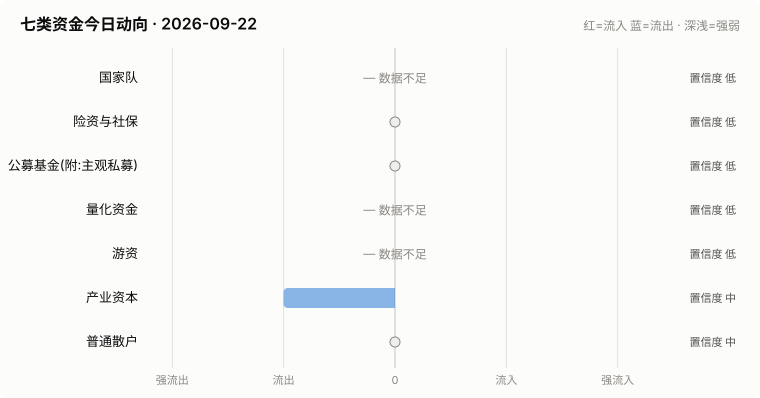

# A股资金动向日报 · 2026-09-22

> 本报告由公开数据自动生成。**方向结论按数据可得性标注置信度**:
> 高=每日硬数据(龙虎榜/公告/两融);中=每日代理指标(行为推断);低=仅低频或间接证据。

> ⚠️ 数据质量提示:本次运行保留了可用字段;缺失字段不补零,备用/历史值不视为当日值。各节中的警告包含具体来源和数据截至日期。

## 一、七类资金动向总览

| 参与者 | 动向 | 置信度 | 一句话解读 |
| --- | --- | --- | --- |
| 国家队 | — 数据不足 | 低 | ETF数据缺失,无法判断。 |
| 险资与社保 | → 中性 | 低 | 无涉险资/社保公告;险资无每日数据,默认视为中性。 |
| 公募基金(附:主观私募) | → 中性 | 低 | ETF份额环比待历史累积;近7天新发权益基金 4亿份。 |
| 量化资金 | → 中性 | 中 | 小微盘成交占比较20日均值偏离 +1.9pp,代理量化策略活跃度变化。 |
| 游资 | → 中性 | 高 | 知名游资席位 3 个上榜,合计净买入 +0.5亿。 |
| 产业资本 | ↓↓ 大幅流出 | 中 | 净增持家数 -26;回购公告 8 家;大宗溢价成交占比 0%。 |
| 普通散户 | ↑ 流入 | 中 | 沪市融资余额环比 +53亿。 |

**历史趋势(随每日运行更新)**

## 二、分项明细

### 2.1 国家队 — — 数据不足(置信度:低)

> ⚠️ ETF快照数据缺失,本节无法判断。

### 2.2 险资与社保 — → 中性(置信度:低)

- 当日扫描持股变动公告 45 条,未发现涉险资/社保/举牌关键词。

> ⚠️ 险资/社保没有每日持仓披露:硬数据仅有季报十大流通股东与举牌公告,本节结论置信度恒为低,建议结合季报数据人工复核。

### 2.3 公募基金(附:主观私募) — → 中性(置信度:低)

- 近7天新成立权益类基金 6 只,合计募集 4.5亿份(反映公募增量资金入场节奏)。

**近7天新成立权益基金(募集前5)**

| 基金代码 | 基金简称 | 基金类型 | 募集份额 | 成立日期 |
| --- | --- | --- | --- | --- |
| 029006 | 平安添鑫债券A | 债券型-混合二级 | 2.03 | 2026-09-16 |
| 029007 | 平安添鑫债券C | 债券型-混合二级 | 2.03 | 2026-09-16 |
| 028688 | 天弘中证全指电力公用事业ETF发起联接A | 指数型-股票 | 0.11 | 2026-09-15 |
| 028689 | 天弘中证全指电力公用事业ETF发起联接C | 指数型-股票 | 0.11 | 2026-09-15 |
| 029001 | 华夏中证全指家用电器ETF发起式联接C | 指数型-股票 | 0.1 | 2026-09-17 |

> ⚠️ ETF实时快照接口今日不可用。
> ⚠️ 主观私募无每日公开持仓/仓位数据,通常仅有第三方月频仓位调查;本报告不对主观私募单独给出每日方向判断。

### 2.4 量化资金 — → 中性(置信度:中)

- 全市场成交 21389亿,其中中证2000成交 4768亿,小微盘成交占比 22.3%,较20日均值(20.4%)偏离 +1.9个百分点。
- 中证2000当日 +0.06%。小微盘成交占比明显上升通常对应量化(高频/微盘策略)活跃度上升,反之为降杠杆或撤退。

> ⚠️ 量化动向为代理推断:公开数据无法区分具体量化策略,仅反映小微盘交易活跃度整体变化。

### 2.5 游资 — → 中性(置信度:高)

- 拉萨系(散户通道)席位当日买入 4.0亿,净买 1.3亿(此项同时作为散户情绪参考)。

**当日龙虎榜净买额前8个股**

| 代码 | 名称 | 收盘价 | 涨跌幅 | 龙虎榜净买额 | 上榜原因 |
| --- | --- | --- | --- | --- | --- |
| 600664 | 哈药股份 | 9.08 | +10.06% | 4.4亿 | 非S证券连续三个交易日内收盘价格涨幅偏离值累计达到20%的证券 |
| 301047 | 义翘神州 | 136.22 | +16.09% | 3.7亿 | 日涨幅达到15%的前5只证券 |
| 002141 | 贤丰控股 | 7.43 | +10.07% | 2.6亿 | 日涨幅偏离值达到7%的前5只证券 |
| 603068 | 博通集成 | 48.17 | +10.00% | 2.2亿 | 非S证券连续三个交易日内收盘价格涨幅偏离值累计达到20%的证券 |
| 000560 | 我爱我家 | 3.51 | +10.03% | 2.2亿 | 连续三个交易日内，涨幅偏离值累计达到20%的证券 |
| 601086 | 国芳集团 | 18.16 | +2.77% | 2.0亿 | 非S证券连续三个交易日内收盘价格涨幅偏离值累计达到20%的证券 |
| 301686 | 中塑股份 | 433.0 | +683.29% | 1.8亿 | 无价格涨跌幅限制的证券 |
| 000756 | 新华制药 | 16.14 | +10.02% | 1.8亿 | 连续三个交易日内，涨幅偏离值累计达到20%的证券 |

**知名游资席位当日动向**

| 营业部名称 | 买入 | 卖出 | 净额 | 买入股票 |
| --- | --- | --- | --- | --- |
| 国盛证券股份有限公司宁波桑田路证券营业部 | 1.1亿 | 0.1亿 | 1.0亿 | 新华制药 |
| 东吴证券股份有限公司苏州西北街证券营业部 | 0.1亿 | 0.1亿 | -0.0亿 | 峆一药业 凯华材料 |
| 华泰证券股份有限公司深圳益田路荣超商务中心证券营业部 | — | 0.5亿 | -0.5亿 | 马矿股份 |

### 2.6 产业资本 — ↓↓ 大幅流出(置信度:中)

- 当日增持公告 7 家,减持公告 33 家,净增持家数 -26。
- 当日更新回购公告 8 家,披露已回购金额合计 5.9亿。
- 大宗交易成交总额 22.6亿,其中溢价成交占比 0.0%(溢价占比高通常代表主动接盘意愿强)。

> ⚠️ 股东增减持计数采用stock_notice_report 持股变动公告代理(非精确股东变动明细),数据截至 2026-09-22(报告日期 2026-09-22)。

### 2.7 普通散户 — ↑ 流入(置信度:中)

- 全市场融资余额约 26144亿(沪 13399亿 + 深 12746亿),沪市环比 53.3亿。
- 最近披露月份(2023-08)新增投资者 99.59 万户,环比 +9.4%(月频指标;该月度口径中登公司已停止披露,仅作历史参考)。

> ⚠️ 沪市融资余额采用stock_margin_sse,数据截至 2026-09-21(报告日期 2026-09-22,滞后 1 个日历日)。
> ⚠️ 沪市融资买入额采用stock_margin_sse,数据截至 2026-09-21(报告日期 2026-09-22,滞后 1 个日历日)。
> ⚠️ 深市融资余额采用stock_margin_szse,数据截至 2026-09-21(报告日期 2026-09-22,滞后 1 个日历日)。
> ⚠️ 深市融资买入额采用stock_margin_szse,数据截至 2026-09-21(报告日期 2026-09-22,滞后 1 个日历日)。
> ⚠️ 个股资金流排行、大盘资金流代理及短期历史快照均不可用,小单口径缺失。

## 三、个股杠杆监测

- 当日两融资金参与度(融资买入额/两市成交额)约 8.69%,较20日均值(8.9%)偏离 -0.2个百分点(比例越高说明当日交易中加杠杆买入的比重越大,市场波动风险通常也更高)。
- 国家队(汇金系宽基ETF)历来是现金申购,不使用融资杠杆,因此没有可比的每日"国家队杠杆"数字;下面的杠杆水位与排行反映的主要是散户与游资的两融行为。
- 当日纳入统计的3279只个股中,214只融资余额占流通市值超过8%(阈值见 config.yaml);建议持有这类个股时使用更紧的止损比例(参考仓位/止损计算器,该工具支持按代码查询个股杠杆水位)。

**个股杠杆最集中(前15只,2026-09-21两融数据)**

| 代码 | 名称 | 融资买入占成交额% | 融资余额占流通市值% | 当日涨跌幅% | 当日振幅% |
| --- | --- | --- | --- | --- | --- |
| 000607 | 华媒控股 | 65.6 | 5.97 | 9.93 | 0.0 |
| 688007 | 光峰科技 | 60.28 | 9.17 | 0.27 | 3.49 |
| 601818 | 光大银行 | 51.05 | 1.04 | -0.33 | 0.66 |
| 600157 | 永泰能源 | 48.09 | 4.04 | 0.0 | 0.66 |
| 600743 | 华远控股 | 45.96 | 1.41 | 9.87 | 0.0 |
| 688602 | 康鹏科技 | 45.49 | 3.69 | -0.29 | 1.29 |
| 002290 | 禾盛新材 | 42.67 | 1.83 | 10.0 | 0.0 |
| 002386 | 天原股份 | 41.55 | 4.65 | -0.81 | 1.47 |
| 688657 | 浩辰软件 | 40.57 | 4.04 | -0.12 | 1.91 |
| 300891 | 惠云钛业 | 39.26 | 3.75 | -2.15 | 3.28 |
| 600329 | 达仁堂 | 35.74 | 2.03 | -0.28 | 0.85 |
| 600770 | 综艺股份 | 35.34 | 4.09 | 9.95 | 0.0 |
| 000885 | 城发环境 | 34.8 | 2.42 | -0.51 | 0.68 |
| 688455 | 科捷智能 | 33.52 | 3.05 | 0.85 | 3.11 |
| 601369 | 陕鼓动力 | 33.41 | 1.97 | -0.55 | 3.43 |

> ⚠️ 沪市融资买入额采用stock_margin_sse,数据截至 2026-09-21(报告日期 2026-09-22,滞后 1 个日历日)。
> ⚠️ 深市融资买入额采用stock_margin_szse,数据截至 2026-09-21(报告日期 2026-09-22,滞后 1 个日历日)。
> ⚠️ 实时行情快照主源不可用,本次排行采用腾讯备用源(数据截至 2026-09-22)。

## 四、数据说明与局限

- 国家队动向为行为推断(宽基ETF放量+指数走势组合),非官方口径;确认需等季报十大股东。
- 险资/社保、主观私募无每日公开数据,相关结论置信度恒为低。
- 量化动向以小微盘成交占比为代理,只反映整体活跃度,无法区分具体策略。
- 游资识别依赖 config.yaml 中的席位关键词表,存在漏配;拉萨系席位计为散户通道。
- 两融、龙虎榜等数据为 T+1 或盘后披露,个别接口更新时间不一。
- 个股杠杆排行剔除了流通市值过小的个股(阈值见 config.yaml),融资余额/买入额与当日行情存在披露时点差异,仅作参考,不构成个股推荐。
> ⚠️ 本报告含缺失、备用或历史快照数据;每条降级数字均按“数据截至 YYYY-MM-DD”标注真实新鲜度。

**本次运行的数据质量明细:**
- 国家队: ETF快照数据缺失,本节无法判断。
- 公募基金(附:主观私募): ETF实时快照接口今日不可用。
- 产业资本: 股东增减持计数采用stock_notice_report 持股变动公告代理(非精确股东变动明细),数据截至 2026-09-22(报告日期 2026-09-22)。
- 普通散户: 沪市融资余额采用stock_margin_sse,数据截至 2026-09-21(报告日期 2026-09-22,滞后 1 个日历日)。
- 普通散户: 沪市融资买入额采用stock_margin_sse,数据截至 2026-09-21(报告日期 2026-09-22,滞后 1 个日历日)。
- 普通散户: 深市融资余额采用stock_margin_szse,数据截至 2026-09-21(报告日期 2026-09-22,滞后 1 个日历日)。
- 普通散户: 深市融资买入额采用stock_margin_szse,数据截至 2026-09-21(报告日期 2026-09-22,滞后 1 个日历日)。
- 普通散户: 个股资金流排行、大盘资金流代理及短期历史快照均不可用,小单口径缺失。
- 个股杠杆监测: 沪市融资买入额采用stock_margin_sse,数据截至 2026-09-21(报告日期 2026-09-22,滞后 1 个日历日)。
- 个股杠杆监测: 深市融资买入额采用stock_margin_szse,数据截至 2026-09-21(报告日期 2026-09-22,滞后 1 个日历日)。
- 个股杠杆监测: 实时行情快照主源不可用,本次排行采用腾讯备用源(数据截至 2026-09-22)。

**本次运行失败的数据源:**
- fund_etf_spot_em: HTTPError: 502 Server Error: Bad Gateway for url: https://push2delay.eastmoney.com/api/qt/clist/get?pn=1&pz=100&po=1&np=1&ut=bd1d9d
- stock_ggcg_em: TimeoutError: 
- stock_ggcg_em: TimeoutError: 
- stock_margin_szse: ValueError: Length mismatch: Expected axis has 0 elements, new values have 6 elements
- stock_individual_fund_flow_rank: JSONDecodeError: Expecting value: line 1 column 1 (char 0)
- stock_market_fund_flow: ConnectionError: ('Connection aborted.', RemoteDisconnected('Remote end closed connection without response'))
- stock_margin_detail_sse: ValueError: Length mismatch: Expected axis has 0 elements, new values have 13 elements
- stock_zh_a_spot_em: ConnectionError: ('Connection aborted.', RemoteDisconnected('Remote end closed connection without response'))
