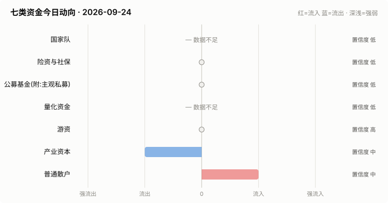

# A股资金动向日报 · 2026-09-24

> 本报告由公开数据自动生成。**方向结论按数据可得性标注置信度**:
> 高=每日硬数据(龙虎榜/公告/两融);中=每日代理指标(行为推断);低=仅低频或间接证据。

> ⚠️ 数据质量提示:本次运行保留了可用字段;缺失字段不补零,备用/历史值不视为当日值。各节中的警告包含具体来源和数据截至日期。

## 一、七类资金动向总览

| 参与者 | 动向 | 置信度 | 一句话解读 |
| --- | --- | --- | --- |
| 国家队 | — 数据不足 | 低 | ETF数据缺失,无法判断。 |
| 险资与社保 | → 中性 | 低 | 无涉险资/社保公告;险资无每日数据,默认视为中性。 |
| 公募基金(附:主观私募) | → 中性 | 低 | ETF份额环比待历史累积;近7天新发权益基金 25亿份。 |
| 量化资金 | — 数据不足 | 低 | 指数数据缺失,无法计算小微盘成交占比。 |
| 游资 | → 中性 | 高 | 知名游资席位 4 个上榜,合计净买入 -0.4亿。 |
| 产业资本 | ↓ 流出 | 中 | 净增持家数 -23;回购公告 9 家;大宗溢价成交占比 6%。 |
| 普通散户 | ↑ 流入 | 中 | 沪市融资余额环比 +67亿。 |

**历史趋势(随每日运行更新)**

## 二、分项明细

### 2.1 国家队 — — 数据不足(置信度:低)

> ⚠️ ETF快照数据缺失,本节无法判断。

### 2.2 险资与社保 — → 中性(置信度:低)

- 当日扫描持股变动公告 45 条,未发现涉险资/社保/举牌关键词。

> ⚠️ 险资/社保没有每日持仓披露:硬数据仅有季报十大流通股东与举牌公告,本节结论置信度恒为低,建议结合季报数据人工复核。

### 2.3 公募基金(附:主观私募) — → 中性(置信度:低)

- 近7天新成立权益类基金 10 只,合计募集 25.2亿份(反映公募增量资金入场节奏)。

**近7天新成立权益基金(募集前5)**

| 基金代码 | 基金简称 | 基金类型 | 募集份额 | 成立日期 |
| --- | --- | --- | --- | --- |
| 028672 | 易方达恒生A股电网设备ETF联接A | 指数型-股票 | 7.02 | 2026-09-17 |
| 028673 | 易方达恒生A股电网设备ETF联接C | 指数型-股票 | 7.02 | 2026-09-17 |
| 028607 | 永赢中证全指证券公司指数A | 指数型-股票 | 3.21 | 2026-09-21 |
| 028608 | 永赢中证全指证券公司指数C | 指数型-股票 | 3.21 | 2026-09-21 |
| 027213 | 易方达中证全指食品ETF联接A | 指数型-股票 | 2.18 | 2026-09-17 |

> ⚠️ ETF实时快照接口今日不可用。
> ⚠️ 主观私募无每日公开持仓/仓位数据,通常仅有第三方月频仓位调查;本报告不对主观私募单独给出每日方向判断。

### 2.4 量化资金 — — 数据不足(置信度:低)

> ⚠️ 指数行情缺失:上证综指,量化活跃度无法计算。
> ⚠️ 量化动向为代理推断:公开数据无法区分具体量化策略,仅反映小微盘交易活跃度整体变化。

### 2.5 游资 — → 中性(置信度:高)

- 拉萨系(散户通道)席位当日买入 4.3亿,净买 0.5亿(此项同时作为散户情绪参考)。

**当日龙虎榜净买额前8个股**

| 代码 | 名称 | 收盘价 | 涨跌幅 | 龙虎榜净买额 | 上榜原因 |
| --- | --- | --- | --- | --- | --- |
| 000592 | 平潭发展 | 8.78 | +10.03% | 4.8亿 | 日涨幅偏离值达到7%的前5只证券 |
| 300300 | 海峡创新 | 10.81 | +19.98% | 2.9亿 | 日涨幅达到15%的前5只证券 |
| 002164 | 宁波东力 | 13.06 | +10.03% | 2.7亿 | 连续三个交易日内，涨幅偏离值累计达到20%的证券 |
| 301689 | 电科思仪 | 83.88 | +20.00% | 1.7亿 | 连续三个交易日内，涨幅偏离值累计达到30%的证券 |
| 002413 | 雷科防务 | 8.97 | +10.06% | 1.7亿 | 日涨幅偏离值达到7%的前5只证券 |
| 002614 | 奥佳华 | 8.33 | +10.04% | 1.5亿 | 连续三个交易日内，涨幅偏离值累计达到20%的证券 |
| 603042 | 华脉科技 | 18.73 | +9.98% | 1.4亿 | 有价格涨跌幅限制的日换手率达到20%的前五只证券 |
| 600792 | 云煤能源 | 5.7 | +10.04% | 1.4亿 | 有价格涨跌幅限制的日收盘价格涨幅偏离值达到7%的前五只证券 |

**知名游资席位当日动向**

| 营业部名称 | 买入 | 卖出 | 净额 | 买入股票 |
| --- | --- | --- | --- | --- |
| 中国银河证券股份有限公司绍兴鲁迅中路证券营业部 | 0.4亿 | 0.3亿 | 0.1亿 | 华媒控股 华瓷股份 海峡创新 |
| 东吴证券股份有限公司苏州西北街证券营业部 | 0.0亿 | 0.1亿 | -0.0亿 | 华媒控股 国统股份 |
| 东莞证券股份有限公司北京分公司 | 0.0亿 | 0.1亿 | -0.1亿 | 莱宝高科 |
| 财通证券股份有限公司杭州上塘路证券营业部 | 0.0亿 | 0.3亿 | -0.3亿 | 电科思仪 |

### 2.6 产业资本 — ↓ 流出(置信度:中)

- 当日增持公告 9 家,减持公告 32 家,净增持家数 -23。
- 当日更新回购公告 9 家,披露已回购金额合计 3.2亿。
- 大宗交易成交总额 10.9亿,其中溢价成交占比 6.1%(溢价占比高通常代表主动接盘意愿强)。

> ⚠️ 股东增减持计数采用stock_notice_report 持股变动公告代理(非精确股东变动明细),数据截至 2026-09-24(报告日期 2026-09-24)。

### 2.7 普通散户 — ↑ 流入(置信度:中)

- 全市场融资余额约 26159亿(沪 13399亿 + 深 12760亿),沪市环比 66.9亿。
- 最近披露月份(2023-08)新增投资者 99.59 万户,环比 +9.4%(月频指标;该月度口径中登公司已停止披露,仅作历史参考)。

> ⚠️ 沪市融资余额采用历史两融快照,数据截至 2026-09-22(报告日期 2026-09-24,滞后 2 个日历日)。
> ⚠️ 沪市融资买入额采用历史两融快照,数据截至 2026-09-22(报告日期 2026-09-24,滞后 2 个日历日)。
> ⚠️ 深市融资余额采用stock_margin_szse,数据截至 2026-09-23(报告日期 2026-09-24,滞后 1 个日历日)。
> ⚠️ 深市融资买入额采用stock_margin_szse,数据截至 2026-09-23(报告日期 2026-09-24,滞后 1 个日历日)。
> ⚠️ 个股资金流排行、大盘资金流代理及短期历史快照均不可用,小单口径缺失。

## 三、个股杠杆监测

- 国家队(汇金系宽基ETF)历来是现金申购,不使用融资杠杆,因此没有可比的每日"国家队杠杆"数字;下面的杠杆水位与排行反映的主要是散户与游资的两融行为。
- 当日纳入统计的1678只个股中,169只融资余额占流通市值超过8%(阈值见 config.yaml);建议持有这类个股时使用更紧的止损比例(参考仓位/止损计算器,该工具支持按代码查询个股杠杆水位)。

**个股杠杆最集中(前15只,2026-09-23两融数据)**

| 代码 | 名称 | 融资买入占成交额% | 融资余额占流通市值% | 当日涨跌幅% | 当日振幅% |
| --- | --- | --- | --- | --- | --- |
| 300948 | 冠中生态 | 52.99 | 4.9 | -0.15 | 5.44 |
| 000541 | 佛山照明 | 48.65 | 4.3 | -0.2 | 1.02 |
| 000049 | 德赛电池 | 34.29 | 3.34 | -1.29 | 1.96 |
| 002372 | 伟星新材 | 33.41 | 1.22 | -1.09 | 1.94 |
| 301053 | 远信工业 | 31.29 | 5.03 | -0.47 | 2.23 |
| 002668 | TCL智家 | 30.21 | 5.12 | 0.22 | 3.25 |
| 002554 | 惠博普 | 29.77 | 4.51 | -0.36 | 1.81 |
| 000900 | 现代投资 | 28.95 | 4.5 | -0.28 | 1.4 |
| 000537 | 绿发电力 | 28.78 | 2.8 | -0.54 | 1.23 |
| 002088 | 鲁阳节能 | 27.54 | 2.75 | -1.59 | 2.2 |
| 000554 | 泰山石油 | 26.87 | 11.87 | 0.48 | 1.61 |
| 301227 | 森鹰窗业 | 26.76 | 5.23 | -2.9 | 3.35 |
| 300989 | 蕾奥规划 | 26.57 | 11.25 | -2.56 | 2.94 |
| 301055 | 张小泉 | 25.82 | 3.65 | -1.35 | 2.29 |
| 301608 | 博实结 | 25.52 | 3.81 | -3.88 | 4.08 |

> ⚠️ 缺失:沪市成交额,市场整体杠杆水位无法计算。
> ⚠️ 实时行情快照主源不可用,本次排行采用腾讯备用源(数据截至 2026-09-24)。
> ⚠️ 个股两融明细缺失沪市,排行仅使用可用市场明细(数据截至 2026-09-23)。

## 四、数据说明与局限

- 国家队动向为行为推断(宽基ETF放量+指数走势组合),非官方口径;确认需等季报十大股东。
- 险资/社保、主观私募无每日公开数据,相关结论置信度恒为低。
- 量化动向以小微盘成交占比为代理,只反映整体活跃度,无法区分具体策略。
- 游资识别依赖 config.yaml 中的席位关键词表,存在漏配;拉萨系席位计为散户通道。
- 两融、龙虎榜等数据为 T+1 或盘后披露,个别接口更新时间不一。
- 个股杠杆排行剔除了流通市值过小的个股(阈值见 config.yaml),融资余额/买入额与当日行情存在披露时点差异,仅作参考,不构成个股推荐。
> ⚠️ 本报告含缺失、备用或历史快照数据;每条降级数字均按“数据截至 YYYY-MM-DD”标注真实新鲜度。

**本次运行的数据质量明细:**
- 国家队: ETF快照数据缺失,本节无法判断。
- 公募基金(附:主观私募): ETF实时快照接口今日不可用。
- 量化资金: 指数行情缺失:上证综指,量化活跃度无法计算。
- 产业资本: 股东增减持计数采用stock_notice_report 持股变动公告代理(非精确股东变动明细),数据截至 2026-09-24(报告日期 2026-09-24)。
- 普通散户: 沪市融资余额采用历史两融快照,数据截至 2026-09-22(报告日期 2026-09-24,滞后 2 个日历日)。
- 普通散户: 沪市融资买入额采用历史两融快照,数据截至 2026-09-22(报告日期 2026-09-24,滞后 2 个日历日)。
- 普通散户: 深市融资余额采用stock_margin_szse,数据截至 2026-09-23(报告日期 2026-09-24,滞后 1 个日历日)。
- 普通散户: 深市融资买入额采用stock_margin_szse,数据截至 2026-09-23(报告日期 2026-09-24,滞后 1 个日历日)。
- 普通散户: 个股资金流排行、大盘资金流代理及短期历史快照均不可用,小单口径缺失。
- 个股杠杆监测: 缺失:沪市成交额,市场整体杠杆水位无法计算。
- 个股杠杆监测: 实时行情快照主源不可用,本次排行采用腾讯备用源(数据截至 2026-09-24)。
- 个股杠杆监测: 个股两融明细缺失沪市,排行仅使用可用市场明细(数据截至 2026-09-23)。

**本次运行失败的数据源:**
- fund_etf_spot_em: HTTPError: 502 Server Error: Bad Gateway for url: https://push2delay.eastmoney.com/api/qt/clist/get?pn=1&pz=100&po=1&np=1&ut=bd1d9d
- stock_sse_deal_daily: JSONDecodeError: Expecting value: line 1 column 1 (char 0)
- stock_ggcg_em: TimeoutError: 
- stock_ggcg_em: TimeoutError: 
- stock_margin_sse: JSONDecodeError: Expecting value: line 1 column 1 (char 0)
- stock_margin_szse: ValueError: Length mismatch: Expected axis has 0 elements, new values have 6 elements
- stock_individual_fund_flow_rank: JSONDecodeError: Expecting value: line 1 column 1 (char 0)
- stock_market_fund_flow: ConnectionError: ('Connection aborted.', RemoteDisconnected('Remote end closed connection without response'))
- stock_margin_detail_sse: JSONDecodeError: Expecting value: line 1 column 1 (char 0)
- stock_margin_detail_sse: JSONDecodeError: Expecting value: line 1 column 1 (char 0)
- stock_zh_a_spot_em: ConnectionError: ('Connection aborted.', RemoteDisconnected('Remote end closed connection without response'))
