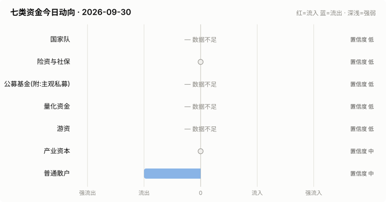
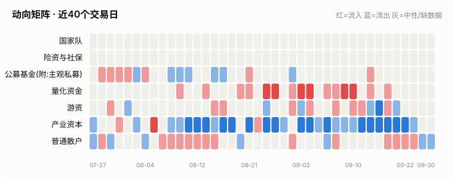
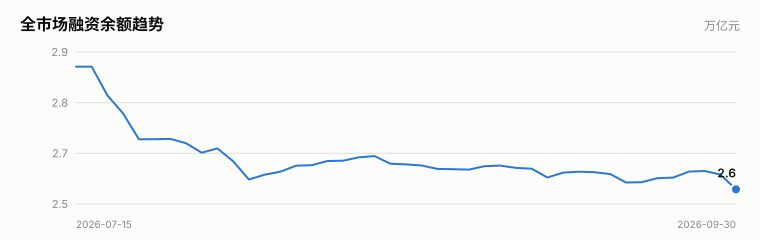
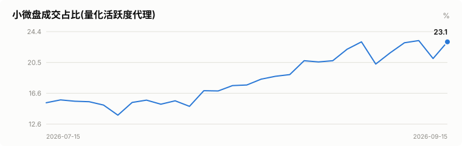
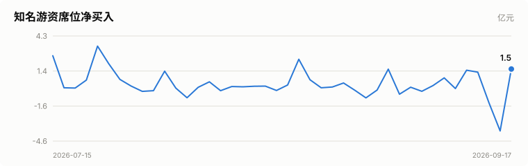
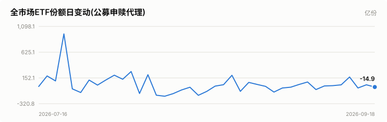
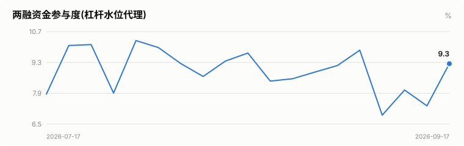

# A股资金动向日报 · 2026-09-30

> 本报告由公开数据自动生成。**方向结论按数据可得性标注置信度**:
> 高=每日硬数据(龙虎榜/公告/两融);中=每日代理指标(行为推断);低=仅低频或间接证据。

> ⚠️ 数据质量提示:本次运行保留了可用字段;缺失字段不补零,备用/历史值不视为当日值。各节中的警告包含具体来源和数据截至日期。

## 一、七类资金动向总览

| 参与者 | 动向 | 置信度 | 一句话解读 |
| --- | --- | --- | --- |
| 国家队 | — 数据不足 | 低 | ETF数据缺失,无法判断。 |
| 险资与社保 | → 中性 | 低 | 无涉险资/社保公告;险资无每日数据,默认视为中性。 |
| 公募基金(附:主观私募) | — 数据不足 | 低 | 数据不足。 |
| 量化资金 | — 数据不足 | 低 | 指数数据缺失,无法计算小微盘成交占比。 |
| 游资 | — 数据不足 | 低 | 龙虎榜数据缺失。 |
| 产业资本 | → 中性 | 中 | 净增持家数 +3;回购公告 11 家。 |
| 普通散户 | ↓ 流出 | 中 | 沪市融资余额环比 -131亿。 |

**历史趋势(随每日运行更新)**

## 二、分项明细

### 2.1 国家队 — — 数据不足(置信度:低)

> ⚠️ ETF快照数据缺失,本节无法判断。

### 2.2 险资与社保 — → 中性(置信度:低)

- 当日扫描持股变动公告 17 条,未发现涉险资/社保/举牌关键词。

> ⚠️ 险资/社保没有每日持仓披露:硬数据仅有季报十大流通股东与举牌公告,本节结论置信度恒为低,建议结合季报数据人工复核。

### 2.3 公募基金(附:主观私募) — — 数据不足(置信度:低)

- 近7天新成立权益类基金 3 只,合计募集 0.0亿份(反映公募增量资金入场节奏)。

**近7天新成立权益基金(募集前5)**

| 基金代码 | 基金简称 | 基金类型 | 募集份额 | 成立日期 |
| --- | --- | --- | --- | --- |
| 029388 | 易方达磐泰一年持有混合Y | 混合型-偏债 | — | 2026-09-29 |
| 029227 | 新华增盈回报债券C | 债券型-混合二级 | — | 2026-09-24 |
| 029397 | 华泰柏瑞招享6个月持有期混合Y | 混合型-偏债 | — | 2026-09-29 |

> ⚠️ ETF实时快照接口今日不可用。
> ⚠️ 主观私募无每日公开持仓/仓位数据,通常仅有第三方月频仓位调查;本报告不对主观私募单独给出每日方向判断。

### 2.4 量化资金 — — 数据不足(置信度:低)

> ⚠️ 指数行情缺失:中证2000、上证综指、深证综指,量化活跃度无法计算。
> ⚠️ 量化动向为代理推断:公开数据无法区分具体量化策略,仅反映小微盘交易活跃度整体变化。

### 2.5 游资 — — 数据不足(置信度:低)

> ⚠️ 龙虎榜个股明细接口今日不可用。
> ⚠️ 活跃营业部接口今日不可用,席位识别缺失。

### 2.6 产业资本 — → 中性(置信度:中)

- 当日增持公告 8 家,减持公告 5 家,净增持家数 +3。
- 当日更新回购公告 11 家,披露已回购金额合计 10.5亿。

> ⚠️ 股东增减持计数采用stock_notice_report 持股变动公告代理(非精确股东变动明细),数据截至 2026-09-30(报告日期 2026-09-30)。
> ⚠️ 大宗交易市场统计尚未更新到当日。
> ⚠️ 大宗交易个股明细接口今日不可用。

### 2.7 普通散户 — ↓ 流出(置信度:中)

- 全市场融资余额约 25735亿(沪 13188亿 + 深 12548亿),沪市环比 -130.7亿。
- 最近披露月份(2023-08)新增投资者 99.59 万户,环比 +9.4%(月频指标;该月度口径中登公司已停止披露,仅作历史参考)。

> ⚠️ 沪市融资余额采用stock_margin_sse,数据截至 2026-09-28(报告日期 2026-09-30,滞后 2 个日历日)。
> ⚠️ 沪市融资买入额采用stock_margin_sse,数据截至 2026-09-28(报告日期 2026-09-30,滞后 2 个日历日)。
> ⚠️ 深市融资余额采用stock_margin_szse,数据截至 2026-09-28(报告日期 2026-09-30,滞后 2 个日历日)。
> ⚠️ 深市融资买入额采用stock_margin_szse,数据截至 2026-09-28(报告日期 2026-09-30,滞后 2 个日历日)。
> ⚠️ 个股资金流排行、大盘资金流代理及短期历史快照均不可用,小单口径缺失。

## 三、个股杠杆监测

- 国家队(汇金系宽基ETF)历来是现金申购,不使用融资杠杆,因此没有可比的每日"国家队杠杆"数字;下面的杠杆水位与排行反映的主要是散户与游资的两融行为。
- 当日纳入统计的3265只个股中,258只融资余额占流通市值超过8%(阈值见 config.yaml);建议持有这类个股时使用更紧的止损比例(参考仓位/止损计算器,该工具支持按代码查询个股杠杆水位)。

**个股杠杆最集中(前15只,2026-09-28两融数据)**

| 代码 | 名称 | 融资买入占成交额% | 融资余额占流通市值% | 当日涨跌幅% | 当日振幅% |
| --- | --- | --- | --- | --- | --- |
| 000850 | 华茂股份 | 238.22 | 5.35 | -9.92 | 0.0 |
| 601579 | 会稽山 | 74.67 | 4.02 | -9.99 | 9.01 |
| 688480 | 赛恩斯 | 70.58 | 3.66 | 1.0 | 3.13 |
| 688391 | 钜泉科技 | 49.56 | 3.08 | 0.11 | 2.23 |
| 601868 | 中国能建 | 43.81 | 1.77 | 0.42 | 1.27 |
| 301070 | 开勒股份 | 43.38 | 8.2 | 0.28 | 3.95 |
| 300985 | 致远新能 | 41.56 | 2.03 | -0.29 | 3.9 |
| 688314 | 康拓医疗 | 39.12 | 3.6 | 0.69 | 2.54 |
| 000510 | 新金路 | 38.68 | 3.94 | 0.94 | 3.57 |
| 688267 | 中触媒 | 36.98 | 7.41 | -0.18 | 2.15 |
| 688093 | 世华科技 | 35.9 | 3.42 | 1.18 | 2.37 |
| 600926 | XD杭州银 | 34.11 | 1.9 | 0.0 | 1.13 |
| 600452 | 涪陵电力 | 34.07 | 3.97 | 0.46 | 1.15 |
| 301557 | 常友科技 | 34.05 | 8.08 | -0.72 | 4.54 |
| 688273 | 麦澜德 | 33.45 | 3.69 | -0.2 | 3.8 |

> ⚠️ 缺失:沪市成交额、深市成交额,市场整体杠杆水位无法计算。
> ⚠️ 实时行情快照主源不可用,本次排行采用腾讯备用源(数据截至 2026-09-30)。

## 四、数据说明与局限

- 国家队动向为行为推断(宽基ETF放量+指数走势组合),非官方口径;确认需等季报十大股东。
- 险资/社保、主观私募无每日公开数据,相关结论置信度恒为低。
- 量化动向以小微盘成交占比为代理,只反映整体活跃度,无法区分具体策略。
- 游资识别依赖 config.yaml 中的席位关键词表,存在漏配;拉萨系席位计为散户通道。
- 两融、龙虎榜等数据为 T+1 或盘后披露,个别接口更新时间不一。
- 个股杠杆排行剔除了流通市值过小的个股(阈值见 config.yaml),融资余额/买入额与当日行情存在披露时点差异,仅作参考,不构成个股推荐。
> ⚠️ 本报告含缺失、备用或历史快照数据;每条降级数字均按“数据截至 YYYY-MM-DD”标注真实新鲜度。

**本次运行的数据质量明细:**
- 国家队: ETF快照数据缺失,本节无法判断。
- 公募基金(附:主观私募): ETF实时快照接口今日不可用。
- 量化资金: 指数行情缺失:中证2000、上证综指、深证综指,量化活跃度无法计算。
- 游资: 龙虎榜个股明细接口今日不可用。
- 游资: 活跃营业部接口今日不可用,席位识别缺失。
- 产业资本: 股东增减持计数采用stock_notice_report 持股变动公告代理(非精确股东变动明细),数据截至 2026-09-30(报告日期 2026-09-30)。
- 产业资本: 大宗交易市场统计尚未更新到当日。
- 产业资本: 大宗交易个股明细接口今日不可用。
- 普通散户: 沪市融资余额采用stock_margin_sse,数据截至 2026-09-28(报告日期 2026-09-30,滞后 2 个日历日)。
- 普通散户: 沪市融资买入额采用stock_margin_sse,数据截至 2026-09-28(报告日期 2026-09-30,滞后 2 个日历日)。
- 普通散户: 深市融资余额采用stock_margin_szse,数据截至 2026-09-28(报告日期 2026-09-30,滞后 2 个日历日)。
- 普通散户: 深市融资买入额采用stock_margin_szse,数据截至 2026-09-28(报告日期 2026-09-30,滞后 2 个日历日)。
- 普通散户: 个股资金流排行、大盘资金流代理及短期历史快照均不可用,小单口径缺失。
- 个股杠杆监测: 缺失:沪市成交额、深市成交额,市场整体杠杆水位无法计算。
- 个股杠杆监测: 实时行情快照主源不可用,本次排行采用腾讯备用源(数据截至 2026-09-30)。

**本次运行失败的数据源:**
- fund_etf_spot_em: HTTPError: 502 Server Error: Bad Gateway for url: https://push2delay.eastmoney.com/api/qt/clist/get?pn=1&pz=100&po=1&np=1&ut=bd1d9d
- stock_sse_deal_daily: ValueError: Length mismatch: Expected axis has 1 elements, new values have 6 elements
- stock_szse_summary: AttributeError: 'float' object has no attribute 'replace'
- stock_lhb_detail_em: TypeError: 'NoneType' object is not subscriptable
- stock_lhb_hyyyb_em: TypeError: 'NoneType' object is not subscriptable
- stock_ggcg_em: TimeoutError: 
- stock_ggcg_em: TimeoutError: 
- stock_dzjy_mrmx: TypeError: 'NoneType' object is not subscriptable
- stock_margin_szse: ValueError: Length mismatch: Expected axis has 0 elements, new values have 6 elements
- stock_margin_szse: ValueError: Length mismatch: Expected axis has 0 elements, new values have 6 elements
- stock_individual_fund_flow_rank: JSONDecodeError: Expecting value: line 1 column 1 (char 0)
- stock_market_fund_flow: ConnectionError: ('Connection aborted.', RemoteDisconnected('Remote end closed connection without response'))
- stock_margin_detail_sse: ValueError: Length mismatch: Expected axis has 0 elements, new values have 13 elements
- stock_margin_detail_sse: ValueError: Length mismatch: Expected axis has 0 elements, new values have 13 elements
- stock_zh_a_spot_em: ConnectionError: ('Connection aborted.', RemoteDisconnected('Remote end closed connection without response'))
